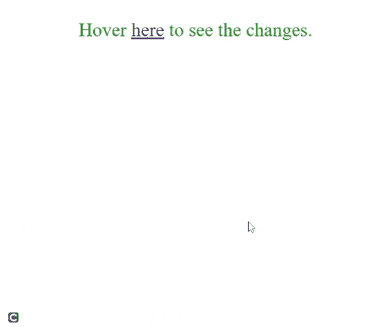

# 如何使用 jQuery 在鼠标悬停和点击时创建一个弹出 div？

> 原文：[https://www.geeksforgeeks.org/how-to-create-a-pop-up-div-on-mouse-over-and-stay-when-click-using-jquery/](https://www.geeksforgeeks.org/how-to-create-a-pop-up-div-on-mouse-over-and-stay-when-click-using-jquery/)

在本文中，我们将学习如何使用 jQuery 在 `mouseover` 上创建一个弹出 `div`，并在单击时保持不动。

## 进场

首先，我们创建一个 HTML `div` 元素，当我们将鼠标悬停在一个元素上时，该元素将弹出，并将其 `display` 属性设置为 `none`。

```css
display:none;
```

在 `<script>` 标签中，我们创建了一个变量 `$flag`，并将其值设置为 `-1`。

```javascript
$flag = -1;
```

现在，在 `<script>` 标记中，我们将选择要将鼠标悬停在其上的元素。它是一个 HTML `<a>` 元素，带类 `gfg`。我们用类 `gfg` 选择元素 `<a>`，然后使用 `hover()` 功能，该功能用于在我们将鼠标悬停在元素上时应用效果。

我们使用两个函数，第一个函数在 `mouseenter` 事件发生时执行。我们用类 `popup` 选择 `<div>`，并使用 jQuery `attr()` 将其 `display` 属性设置为 `block`。当 `mouseleave` 事件发生时，第二个函数执行，当 `$flag` 不等于 `-1` 时，`<div>` 的 `display` 值为 `none`。

## JavaScript 代码

```javascript
$("a.gfg").hover(
    function () {
        $("div.popup").attr("style", "display:block");
    },
    function () {
        if ($flag == -1) {
            $("div.popup").attr("style", "display:none");
        }
    }
);
```

我们在元素 `<a>` 上添加一个 jQuery `click` 事件。当我们点击元素 `<a>` 时，函数将变量 `$flag` 值设置为 `1`，因此 `<div>` 元素在点击后保持不变。

```javascript
$("a.gfg").click(function () {
    $flag = 1;
});
```

## HTML 代码

下面是上述方法的完整实现。

```html
<!DOCTYPE html>
<html>

<head>

<!-- JQuery CDN -->
    <script src=
"https://ajax.googleapis.com/ajax/libs/jquery/3.5.1/jquery.min.js">
    </script>

<style>
        center {
            font-size: 30px;
            color: green;
        }

.popup {
            display: none;
            width: 500px;
            border: solid red 3px
        }
    </style>
</head>

<body>
    <center>
        <p>
            Hover <a href="#" class="gfg">here</a> 
            to see the changes.
        </p>

<div class="popup">
            GeeksforGeeks
        </div>
    </center>

<script>
        $flag = -1;

$("a.gfg").hover(
            function () {
                $("div.popup").attr("style", "display:block");
            },
            function () {
                if ($flag == -1) {
                    $("div.popup").attr("style", "display:none");
                }
            }
        );

$("a.gfg").click(function () {
            $flag = 1;
        });
    </script>
</body>

</html>
```

## 输出



弹出鼠标悬停