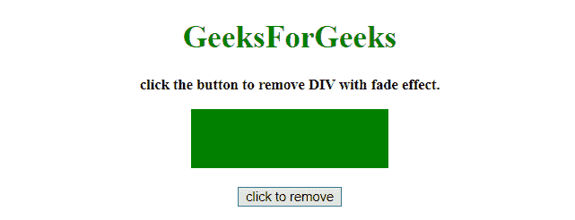
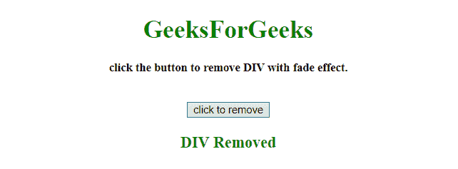

# 如何使用 jQuery 淡出和移除 div？

> 原文：[https://www.geeksforgeeks.org/how-to-fadeout-and-remove-a-div-using-jquery/](https://www.geeksforgeeks.org/how-to-fadeout-and-remove-a-div-using-jquery/)

给定一个 div 元素。任务是使用 JQuery 用淡出效果移除它。这里讨论几个方法。
首先要知道的几个方法。

## jQuery `text()` 方法
该方法设置/返回所选元素的文本内容。
如果使用此方法返回内容，则提供所有匹配元素的文本内容（HTML 标签将被移除）。
如果用这个方法设置内容，它会替换所有匹配元素的内容。

**语法：**

*   **返回文字内容：**
    ```html
    $(selector).text()
    ```

*   **设置文字内容：**
    ```html
    $(selector).text(content)
    ```

*   **使用函数设置文字内容：**
    ```html
    $(selector).text(function(index, curContent))
    ```

**参数：**

*   `content`：此参数为必填项。它为选定的元素指定新的文本内容。
*   `function(index, curContent)`：此参数可选。它指定了一个函数，为选定的元素返回新的文本内容。
    *   `index`：返回元素在集合中的索引位置。
    *   `curContent`：返回当前选中元素的内容。

## jQuery `fadeOut()` 方法
此方法逐渐更改所选元素的不透明度，从可见变为隐藏（淡出效果）。

**语法：**

```html
$(selector).fadeOut(speed, easing, callback)
```

**参数：**

*   `speed`：此参数为可选。它指定淡入淡出效果的速度。默认值 = 400 毫秒。
    适用价值。
    *   `毫秒`
    *   `"慢"`
    *   `"快"`
*   `easing`：此参数为可选。它指定了元素在动画不同点的速度。默认值 = `"摆动"`。
    适用价值。
    *   `"摆动"`：起步慢，中间快。
    *   `"线性"`：匀速运动。
*   `callback`：此参数可选。它指定了 `fadeOut()` 方法完成后要执行的功能。

## jQuery `on()` 方法
此方法为所选元素和子元素添加一个或多个事件处理程序。

**语法：**

```html
$(selector).on(event, childSelector, data, function, map)
```

**参数：**

*   `event`：此参数为必填项。它指定一个或多个要附加到选定元素的事件或命名空间。
    如果有多个事件值，用空格隔开。事件必须是有效的。
*   `childSelector`：该参数可选。它指定事件处理程序应该只附加到已定义的子元素。
*   `data`：此参数为可选。它指定要传递给函数的附加数据。
*   `function`：此参数为必选项。它指定事件发生时要运行的函数。
*   `map`：它指定了一个事件映射（`{event:func(), event:func(), ...}`），该事件映射有一个或多个要添加到所选元素的事件，以及事件发生时要运行的函数。

## jQuery `remove()` 方法
此方法移除所选元素，包括所有文本和子节点以及所选元素的数据和事件。

**语法：**

```html
$(selector).remove(selector)
```

**参数：**

*   `selector`：此参数可选。它指定要删除的一个或多个元素。使用逗号作为分隔符删除多个元素。

## 示例 1
在本示例中，`div` 元素在 `淡出效果` 持续 300 毫秒后被移除。

```html
<!DOCTYPE HTML>
<html>
<head>
    <title>
        JQuery | How to FadeOut and Remove a div.
    </title>
    <script src="https://ajax.googleapis.com/ajax/libs/jquery/3.4.0/jquery.min.js">
    </script>
    <style>
        #div {
            height: 60px;
            width: 200px;
            background-color: green;
            margin: 0 auto;
        }
    </style>
</head>
<body style="text-align:center;" id="body">
    <h1 id="h" style="color:green;">
        GeeksForGeeks
    </h1>
    <p id="GFG_UP" style="font-size: 15px; font-weight: bold;">
        click the button to remove DIV with fade effect.
    </p>
    <div id="div">
    </div>
    <br>
    <button>
        click to remove
    </button>
    <p id="GFG_DOWN" style="color:green; font-size: 20px; font-weight: bold;">
    </p>
    <script>
        $('button').on('click', function(e) {
            $('#div').fadeOut(300, function() {
                $('#div').remove();
            });
            $("#GFG_DOWN").text("DIV Removed");
        });
    </script>
</body>
</html>
```

**输出：**

*   **点击按钮前：**
    
*   **点击按钮后：**
    

## 示例 2
本例与前面类似。在本例中，`div` 元素在 `淡出效果` 300 毫秒后以不同的方式被移除。

```html
<!DOCTYPE HTML>
<html>
<head>
    <title>
        JQuery | How to FadeOut and Remove a div.
    </title>
    <script src="https://ajax.googleapis.com/ajax/libs/jquery/3.4.0/jquery.min.js">
    </script>
    <style>
        #div {
            height: 60px;
            width: 200px;
            background-color: green;
            margin: 0 auto;
        }
    </style>
</head>
<body style="text-align:center;" id="body">
    <h1 id="h" style="color:green;">
        GeeksForGeeks
    </h1>
    <p id="GFG_UP" style="font-size: 15px; font-weight: bold;">
        click the button to remove DIV with fade effect.
    </p>
    <div id="div">
    </div>
    <br>
    <button onclick='$("#div").fadeOut(300, function() { $(this).remove(); $("#GFG_DOWN").text("DIV Removed"); });'>
        click to remove
    </button>
    <p id="GFG_DOWN" style="color:green; font-size: 20px; font-weight: bold;">
    </p>
</body>
</html>
```

**输出：**

*   **点击按钮前：**
    
*   **点击按钮后：**
    