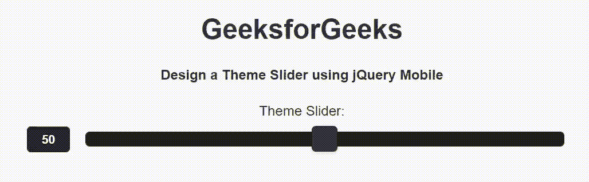

# 如何使用 jQuery Mobile 制作主题滑块？

> 原文：[https://www.geeksforgeeks.org/how-to-make-a-theme-slider-using-jquery-mobile/](https://www.geeksforgeeks.org/how-to-make-a-theme-slider-using-jquery-mobile/)

jQuery Mobile 是一种基于网络的技术，用于制作可在所有智能手机、平板电脑和台式机上访问的响应内容。在本文中，我们将使用 jQuery Mobile 创建一个主题滑块。

## 方法

添加项目所需的 jQuery Mobile 脚本。

> ```html
> <link rel="stylesheet" href="http://code.jquery.com/mobile/1.4.5/jquery.mobile-1.4.5.min.css">
> <script src="http://code.jquery.com/jquery-1.11.1.min.js"></script>
> <script src="http://code.jquery.com/mobile/1.4.5/jquery.mobile-1.4.5.min.js"></script>
> ```

## 示例

我们将使用 jQuery Mobile 创建一个基本滑块。滑块是一种使用滑块插入数据的输入类型。我们使用 `type="range"` 属性配合 `<input>` 元素来创建一个 Slider。另外，使用 `data-track-theme="b"` 和 `data-theme="b"` 属性设置主题。

```html
<!DOCTYPE html>
<html>

<head>
    <link rel="stylesheet" href=
"http://code.jquery.com/mobile/1.4.5/jquery.mobile-1.4.5.min.css" />

<script src="http://code.jquery.com/jquery-1.11.1.min.js">
    </script>

<script src=
"http://code.jquery.com/mobile/1.4.5/jquery.mobile-1.4.5.min.js">
    </script>
</head>

<body>
    <center>
        <h1>GeeksforGeeks</h1>

<h4>
            Design a Theme Slider
            using jQuery Mobile
        </h4>

<form style="width: 50%;">
            <label for="slider">
                Theme Slider:
            </label>

<input type="range" name="slider" 
                id="slider" data-track-theme="b" 
                data-theme="b" min="0" max="100"
                value="50">
        </form>
    </center>
</body>

</html>
```

**输出：**

