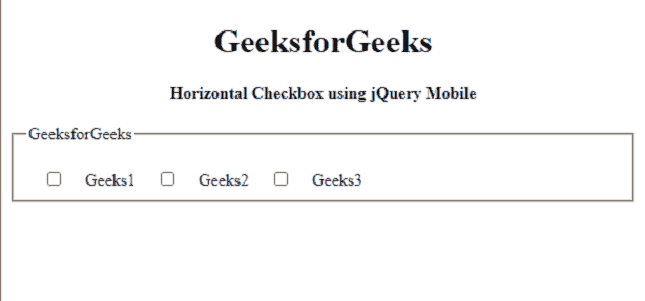
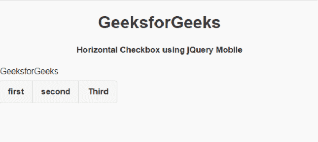

# 如何使用 jQuery Mobile 制作水平复选框控件组？

> 原文: [https://www.geeksforgeeks.org/how-to-make-horizontal-checkbox-controlgroups-using-jquery-mobile/](https://www.geeksforgeeks.org/how-to-make-horizontal-checkbox-controlgroups-using-jquery-mobile/)

`jQuery Mobile` 是一种基于网络的技术，用于制作可在所有智能手机、平板电脑和台式机上访问的响应内容。在本文中，我们将使用 `jQuery Mobile` 创建一个水平复选框控件按钮组。

## 进场

添加项目所需的 jQuery 移动脚本。

```html
<link rel="stylesheet" href="http://code.jquery.com/mobile/1.4.5/jquery.mobile-1.4.5.min.css">
<script src="http://code.jquery.com/jquery-1.11.1.min.js"></script>
<script src="http://code.jquery.com/mobile/1.4.5/jquery.mobile-1.4.5.min.js"></script>
```

## 例 1

```html
<!DOCTYPE html>
<html>

<head>
    <link rel="stylesheet" href=
"http://code.jquery.com/mobile/1.4.5/jquery.mobile-1.4.5.min.css" />

<script src=
        "http://code.jquery.com/jquery-1.11.1.min.js">
    </script>

<script src=
"http://code.jquery.com/mobile/1.4.5/jquery.mobile-1.4.5.min.js">
    </script>
</head>

<body>
    <center>
        <h1>GeeksforGeeks</h1>

<h4>
            Horizontal Checkbox 
            using jQuery Mobile
        </h4>
    </center>

<fieldset data-role="controlgroup" 
        data-type="horizontal">

<legend>GeeksforGeeks</legend>
        <input type="checkbox" name="gfg" id="gfg1">
        <label for="gfg1">Geeks1</label>
        <input type="checkbox" name="gfg" id="gfg2">
        <label for="gfg2">Geeks2</label>
        <input type="checkbox" name="gfg" id="gfg3">
        <label for="gfg3">Geeks3</label>
    </fieldset>
</body>

</html>
```

**输出:**



## 例 2

```html
<!DOCTYPE html>
<html>

<head>
    <link rel="stylesheet" href=
"http://code.jquery.com/mobile/1.4.5/jquery.mobile-1.4.5.min.css" />

<script src=
        "http://code.jquery.com/jquery-1.11.1.min.js">
    </script>

<script src=
"http://code.jquery.com/mobile/1.4.5/jquery.mobile-1.4.5.min.js">
        </script>
</head>

<body>
    <center>
        <h1>GeeksforGeeks</h1>

<h4>
            Horizontal Checkbox using 
            jQuery Mobile
        </h4>
    </center>

<fieldset data-role="controlgroup" 
        data-type="horizontal">

<legend>GeeksforGeeks</legend>
        <input type="checkbox" name="gfg" id="gfg1">
        <label for="gfg1">first</label>
        <input type="checkbox" name="gfg" id="gfg2">
        <label for="gfg2">second</label>
        <input type="checkbox" name="gfg" id="gfg3">
        <label for="gfg3">Third</label>
    </fieldset>
</body>

</html>
```

**输出:**

