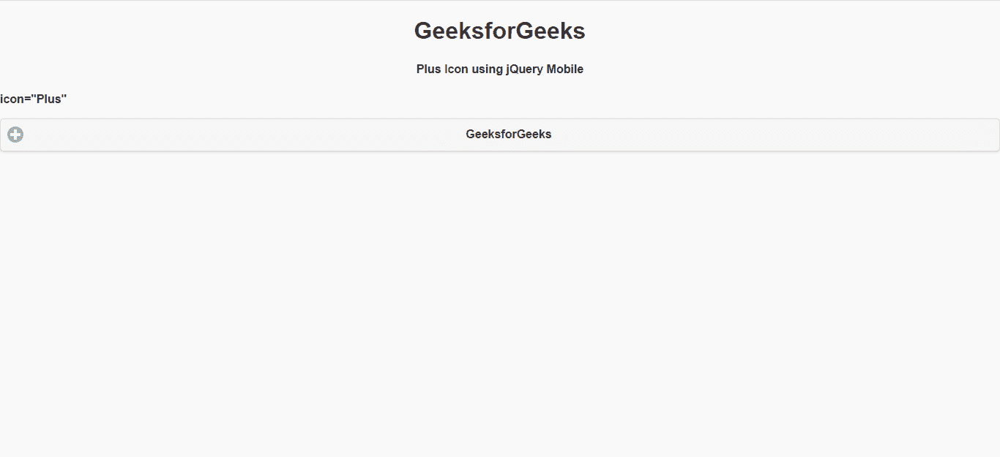

# 如何使用 jQuery Mobile 制作加号图标？

> 原文：[https://www.geeksforgeeks.org/how-to-make-plus-icon-using-jquery-mobile/](https://www.geeksforgeeks.org/how-to-make-plus-icon-using-jquery-mobile/)

`jQuery Mobile` 是一种基于网络的技术，用于制作可在所有智能手机、平板电脑和台式机上访问的响应内容。在本文中，我们将使用 `jQuery Mobile` 制作加号图标。

**方法：** 首先，添加项目所需的 `jQuery Mobile` 脚本。

> ```html
> <link rel="stylesheet" href="http://code.jquery.com/mobile/1.4.5/jquery.mobile-1.4.5.min.css"/>
> <script src="http://code.jquery.com/jquery-1.11.1.min.js"></script>
> <script src="http://code.jquery.com/mobile/1.4.5/jquery.mobile-1.4.5.min.js"></script>
> ```

## 例 1

```html
<!DOCTYPE html>
<html>

<head>
    <link rel="stylesheet" href=
"http://code.jquery.com/mobile/1.4.5/jquery.mobile-1.4.5.min.css" />

<script src=
        "http://code.jquery.com/jquery-1.11.1.min.js">
    </script>

<script src=
"http://code.jquery.com/mobile/1.4.5/jquery.mobile-1.4.5.min.js">
    </script>
</head>

<body>
    <center>
        <h1>`GeeksforGeeks`</h1>
        <h4>Plus Icon using `jQuery Mobile`</h4>
    </center>

<p>`icon="Plus"`</p>

<a href="https://www.geeksforgeeks.org/"
        `data-role`="button" `data-icon`="plus">
        `GeeksforGeeks`
    </a>
</body>

</html>
```

**输出：**



## 例 2

```html
<!DOCTYPE html>
<html>

<head>
    <link rel="stylesheet" href=
"http://code.jquery.com/mobile/1.4.5/jquery.mobile-1.4.5.min.css" />

<script src=
        "http://code.jquery.com/jquery-1.11.1.min.js">
    </script>

<script src=
"http://code.jquery.com/mobile/1.4.5/jquery.mobile-1.4.5.min.js">
    </script>
</head>

<body>
    <center>
        <h1>`GeeksforGeeks`</h1>
        <h4>Plus Icon using `jQuery Mobile`</h4>
    </center>

<p>`icon="Plus"`</p>

<button id="gfg" `data-role`="button" 
        `data-icon`="plus">
        `GeeksforGeeks`
    </button>
</body>

</html>
```

**输出：**

