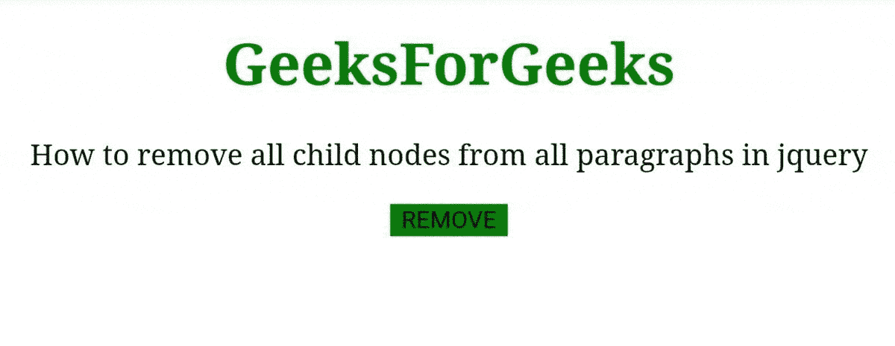
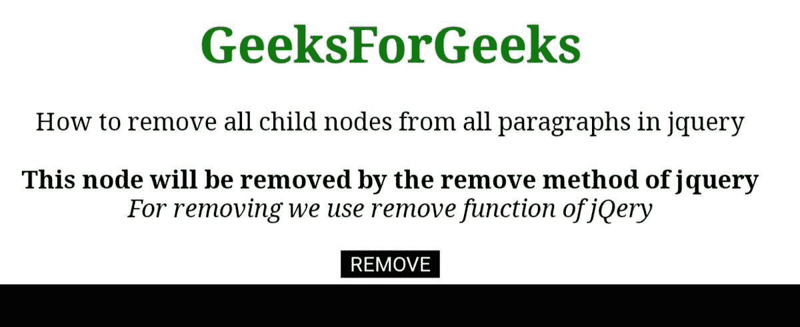
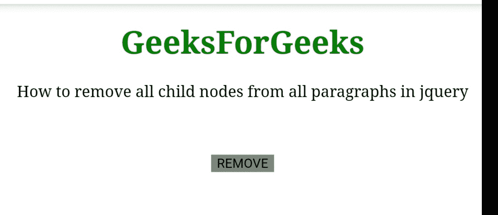

# 如何删除 jQuery 中所有段落的所有子节点？

> 原文：[https://www.geeksforgeeks.org/how-to-removes-all-child-nodes-from-all-paragraphs-in-jquery/](https://www.geeksforgeeks.org/how-to-removes-all-child-nodes-from-all-paragraphs-in-jquery/)

在本文中，我们将学习如何从 jQuery 的所有段落中移除所有子节点。子节点是段落的子标签。这里，我们的任务是移除 DOM 中 `<p>` 标签的所有子标签。我们可以用不同的方法删除 jQuery 中所有段落的所有子节点。

## 方法 1

在此方法中，我们将使用 [`detach()`](https://www.geeksforgeeks.org/jquery-detach-with-examples/) 方法，该方法用于从 DOM 中移除所选项目。我们监听按钮点击事件，然后使用 [`children()`](https://www.geeksforgeeks.org/jquery-children-with-examples/) 方法选择子元素并删除子节点。我们遵循以下步骤：

*   首先，我们用 [`children()`](https://www.geeksforgeeks.org/jquery-children-with-examples/) 方法选择子节点。
*   选择完段落的所有节点后，我们使用 [`detach()`](https://www.geeksforgeeks.org/jquery-detach-with-examples/) 方法。

### 示例

#### HTML 示例

```html
<!DOCTYPE html>
<html>

<head>
    <script src=
"https://code.jquery.com/jquery-3.6.0.js">
    </script>
    <title>
        How to remove all child nodes 
        from all paragraphs?
    </title>
</head>

<body style="text-align:center;">
    <h1 style="color:green;">
        GeeksForGeeks
    </h1>

    <p>
        How to remove all child nodes from 
        all paragraphs in jquery
        <br><br>
        <b>
            This node will be removed by 
            the detach of jquery
        </b>
    </p>

    <button style="background-color:green;
        border: none; color: black">
        REMOVE
    </button>

    <script>
        // jQuery for deleting child node
        $("button").click(function () {
            $("p").children().detach();
        });
    </script>
</body>

</html>
```

### 输出



通过 `detach()` 删除节点。

## 方法 2

在该方法中，我们将使用 [`remove()`](https://www.geeksforgeeks.org/jquery-remove/) 方法，该方法用于移除所选元素的所有元素，包括所有数据和事件。这里当我们点击按钮时，jQuery 选择所有 `<p>` 标签的子节点，并对选中的项目运行 [`remove()`](https://www.geeksforgeeks.org/jquery-remove/) 功能。我们遵循以下步骤：

*   首先，我们创建一个运行函数的点击事件。
*   它在 `<p>` 标签上使用 [`children()`](https://www.geeksforgeeks.org/jquery-children-with-examples/) 函数来选择所有子节点。
*   最后在段落的选定子节点上应用 [`remove()`](https://www.geeksforgeeks.org/jquery-remove/) 方法。

### 示例

#### HTML 示例

```html
<!DOCTYPE html>
<html>

<head>
    <script src=
"https://code.jquery.com/jquery-3.6.0.js">
    </script>

    <title>
        How to remove all child nodes 
        from all paragraphs?
    </title>
</head>

<body style="text-align:center;">
    <h1 style="color:green;">
        GeeksForGeeks
    </h1>

    <p>
        How to remove all child nodes from 
        all paragraphs in jquery
        <br><br>
        <b>
            This node will be removed by the 
            remove method of jquery
        </b>
        <br>
        <i>
            For removing we use remove 
            function of jQuery 
        </i>
    </p>

    <button style="background-color:black;
        border: none; color: white">
        REMOVE
    </button>

    <script>
        // jQuery for deleting child node
        $("button").click(function () {
            $("p").children().remove();
        });
    </script>
</body>

</html>
```

### 输出



使用 `remove()` 移除节点。

## 方法 3

在该方法中，我们将使用 [`empty()`](https://www.geeksforgeeks.org/jquery-empty-with-examples/) 方法，该方法是用于移除所选项目的所有节点及其内容的内置功能。[`children()`](https://www.geeksforgeeks.org/jquery-children-with-examples/) 方法用于选择段落的所有子节点。我们遵循以下步骤：

*   我们首先等待 DOM 加载，然后运行函数。
*   函数监听按钮点击事件，然后运行该函数。
*   函数使用 [`children()`](https://www.geeksforgeeks.org/jquery-children-with-examples/) 函数选择段落的所有子节点。
*   通过 [`empty()`](https://www.geeksforgeeks.org/jquery-empty-with-examples/) 功能删除选中的元素。

### 示例

#### HTML 示例

```html
<!DOCTYPE html>
<html>

<head>
    <script src=
"https://code.jquery.com/jquery-3.6.0.js">
    </script>

    <title>
        How to remove all child nodes 
        from all paragraphs?
    </title>
</head>

<body style="text-align:center;">
    <h1 style="color:green;">
        GeeksForGeeks
    </h1>

    <p>
        How to remove all child nodes 
        from all paragraphs in jquery
        <br><br>
        <b>
            This node will be removed by 
            the empty method of jquery
        </b>
        <br>
        <b>
            <i>
                For removing we use Empty 
                function of jQuery 
            </i>
        </b>
    </p>

    <button style="background-color:Gray;
        border: none; color: black">
        REMOVE
    </button>

    <script>
        // jQuery for deleting child node
        $(document).ready(function () {
            $("button").click(function () {
                $("p").children().empty();
            });
        });
    </script>
</body>

</html>
```

### 输出



使用 `empty()` 移除空的节点。