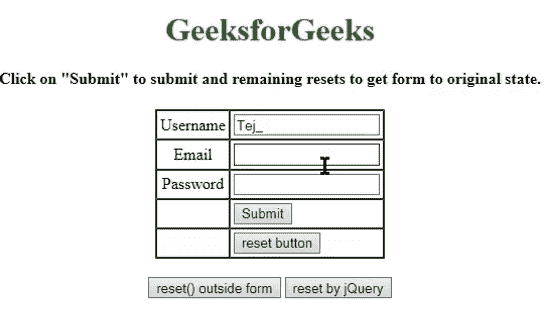

# 如何使用 jQuery 的 reset() 方法重置表单？

> 原文：[https://www.geeksforgeeks.org/how-to-reset-a-form-using-jquery-with-reset-method/](https://www.geeksforgeeks.org/how-to-reset-a-form-using-jquery-with-reset-method/)



重置会将任何内容恢复到其原始状态。jQuery 没有 `reset()` 方法，但是原生 JavaScript 有。因此，我们将 jQuery 元素转换成一个 JavaScript 对象。

## JavaScript `reset()`

`Reset()` 方法重置表单中所有元素的值（与单击 Reset 按钮相同）。

### JavaScript 重置按钮的语法：

*   ```html
    // type-1
    <input type="reset">
    ```

*   ```html
    // type-2
    <input type="button" onclick="this.form.reset();">
    ```

*   ```html
    // type-3
    <input type="button" onclick="formname.reset();">
    ```

按钮本身会重置表单，但是对于 type-1 和 type-2，重置按钮应该在表单内部，type-3 可以是外部也可以是内部。但重置按钮是一个好得多的选择（类型 1）。

*   ```html
    <input type="reset">
    ```

*   `reset()` 的语法：

    ```html
    formObject.reset()
    ```

*   将 jQuery 元素转换为 JavaScript 对象的语法：

    ```html
    $(selector)[0].reset()
    ```

    或者

    ```html
    $(selector).get(0).reset()
    ```

如果我们不想将 jQuery 元素转换成 JavaScript 对象，那么我们可以使用 [`trigger()`](https://www.geeksforgeeks.org/jquery-trigger-method/)。

> 作为 `trigger()` 方法，为所选元素触发指定的事件和事件的默认行为（如表单提交）。
> **语法**
> ```html
> $(selector).trigger(event, eventObj, ...)
> ```

## 示例

```html
<!DOCTYPE html>
<html>
<head>
    <title>Try jQuery Online</title>
    <script src="https://ajax.googleapis.com/ajax/libs/jquery/3.4.1/jquery.min.js"></script>
    <script>
        $(document).ready(function() {
            $("button").click(function() {
                //$("#d").trigger("reset");
                //$("#d").get(0).reset();
                $("#d")[0].reset()
            });
        });
    </script>
</head>
<body>
    <center>
        <h1 style="color:green">GeeksforGeeks</h1>
        <h4>
            Click on "Submit" to submit and
            remaining resets to get form to original state.
        </h4>
        <form id="d" action="/cgi-bin/test.cgi" name="geek">
            <table cellspacing="0" cellpadding="3" border="1">
                <tr>
                    <td align="center">Username</td>
                    <td>
                        <input type="text" name="name" />
                    </td>
                </tr>
                <tr>
                    <td align="center">Email</td>
                    <td>
                        <input type="text" name="name" />
                    </td>
                </tr>
                <tr>
                    <td align="center">Password</td>
                    <td>
                        <input type="password" />
                    </td>
                </tr>
                <tr>
                    <td align="center"></td>
                    <td>
                        <input type="submit" value="Submit" />
                    </td>
                </tr>
                <tr>
                    <td align="center"></td>
                    <td>
                        <input type="reset" value="reset button" />
                    </td>
                </tr>
            </table>
        </form>
        <br>
        <input type="button"
               value="reset() outside form"
               onclick="geek.reset();" />
        <button>resetby jQuery</button>
    </center>
</body>
</html>
```

**输出**

<video class="wp-video-shortcode" id="video-357041-1" width="612" height="322" autoplay="" preload="metadata" controls=""><source type="video/mp4" src="https://media.geeksforgeeks.org/wp-content/uploads/20191103080522/reset.mp4?_=1">[https://media.geeksforgeeks.org/wp-content/uploads/20191103080522/reset.mp4](https://media.geeksforgeeks.org/wp-content/uploads/20191103080522/reset.mp4)</video>

jQuery 是一个开源的 JavaScript 库，它简化了 HTML/CSS 文档之间的交互，它以其“少写多做”的理念而闻名。
跟随本 [jQuery 教程](https://www.geeksforgeeks.org/jquery-tutorials/) 和 [jQuery 示例](https://www.geeksforgeeks.org/jquery-examples/) 可以从头开始学习 jQuery。