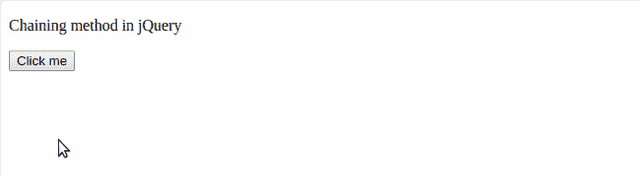
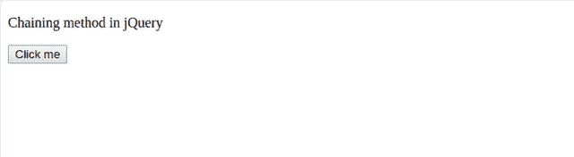

# jQuery 链式调用

> 原文：`https://www.geeksforgeeks.org/jquery-chaining/`

jQuery 是一个非常强大的 JavaScript 框架。使用 jQuery，我们可以使用链式调用（chaining），这意味着在单个元素的单个语句中将多个方法链接在一起。
我们一直一次使用一条语句，但是现在使用链式调用方法，我们可以绑定多个方法，使代码变短。这样，浏览器不必多次查找相同的元素。

## 优势

在 jQuery 中使用方法链的同时，保证了不需要多次使用同一个选择器。过度使用选择器会严重降低代码的速度，因为每次你调用选择器时，你都在强迫浏览器去寻找它。通过组合或“链接”多个方法，您可以大大减少浏览器查找相同元素的次数，而无需设置任何变量。

## 使用 JavaScript 和 jQuery 实现链式调用

为了更好的理解：

### 代码#1

使用上下滑动方法函数进行链接：

```html
<!DOCTYPE html>
<html>

<head>
    <script src="https://ajax.googleapis.com/ajax/libs/jquery/3.3.1/jquery.min.js">
    </script>
</head>

<body>
    <p id="para">Chaining method in jQuery</p>

<button>Click me</button>

<script type="text/javascript">
        $(document).ready(function() {
            $("button").click(function() {
                //assigning the color blue
                $("#para").css("color", "blue")
                //using slide up method
                    .slideUp(2000)
                  //using slide down method
                    .slideDown(2000)
                    .slideUp(2000)
                    .slideDown(4000);
            });
        });
    </script>
</body>

</html>
```

**输出：**


### 代码#2

使用 jQuery 中的动画功能进行链接效果：

```html
<!DOCTYPE html>
<html>

<head>
    <script src="https://ajax.googleapis.com/ajax/libs/jquery/3.3.1/jquery.min.js">
    </script>

</head>

<body>

<p id="para">Chaining method in jQuery</p>

<button>Click me</button>

<script type="text/javascript">
       $(document).ready(function() {
        $("button").click(function() {
         $("#para").css("color", "blue").animate({
               width: "100%"
            })
            //it adds animation to the program by styling it
            .animate({
               fontSize: "46px"
             })
            .animate({
                borderWidth: 30
             });
            });
        });
    </script>
</body>

</html>
```

**输出：**
