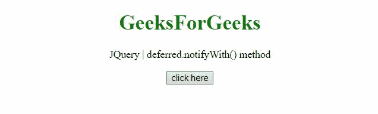
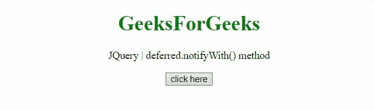

# jQuery deferred.notifyWith() 方法

> 原文: [https://www.geeksforgeeks.org/jquery-deferred-notifywith-method/](https://www.geeksforgeeks.org/jquery-deferred-notifywith-method/)

jQuery 中的 `deferred.notifyWith()` 方法用于在 `deferred` 对象上调用 `progress` 回调，并提供指定的上下文和参数。

## 语法

```html
deferred.notifyWith(context[, args])
```

## 参数

*   `context`: 此参数是作为 `this` 对象传递给 `progress` 回调的上下文。
*   `args`: 该参数是传递给 `progress` 回调的可选参数数组。

## 返回值

该方法返回延迟（`deferred`）对象。

下面讨论两个例子：

### 例子-1

在这个例子中，我们用两个参数通知延迟对象，并在拒绝它之前处理任何 `progress` 回调。

```html
<!DOCTYPE HTML> 
<html>  
<head> 
    <title> 
      jQuery | deferred.notifyWith() method
    </title>
    <script src="https://code.jquery.com/jquery-3.5.0.js"></script> 
</head>   
<body style="text-align:center;">
    <h1 style="color:green;">  
        GeeksForGeeks  
    </h1> 
    <p id="GFG_UP"> 
    </p>
    <button onclick = "Geeks();">
    click here
    </button>
    <p id="GFG_DOWN"> 
    </p>
    <script> 
        var el_up = document.getElementById("GFG_UP");
        el_up.innerHTML = "jQuery | deferred.notifyWith() method";
        function Func(val, div){
          $(div).append('From function "Func": ' + val);
        }
        function Geeks() {
            var def = $.Deferred();
            def.progress(Func);
            def.notifyWith(this, ['notifyWith() is called with arguments. <br />', '#GFG_DOWN']);
        } 
    </script> 
</body>   
</html>
```

#### 输出


### 示例-2

在本例中，我们仅用一个参数通知延迟对象，并在解析它之前处理任何 `progress` 回调。

```html
<!DOCTYPE HTML> 
<html>  
<head> 
    <title> 
      jQuery | deferred.notifyWith() method
    </title>
    <script src="https://code.jquery.com/jquery-3.5.0.js">
    </script> 
</head>   
<body style="text-align:center;">
    <h1 style="color:green;">  
        GeeksForGeeks  
    </h1> 
    <p id="GFG_UP"> 
    </p>
    <button onclick = "Geeks();">
    click here
    </button>
    <p id="GFG_DOWN"> 
    </p>
    <script> 
        var el_up = document.getElementById("GFG_UP");
        el_up.innerHTML = "jQuery | deferred.notifyWith() method";
        function Func(val, div){
          $(div).append('From function "Func": ' + val);
        }
        function Geeks() {
            var def = $.Deferred();
            def.done(Func);
            def.progress(Func);
            def.notifyWith(this, ['#GFG_DOWN']);
            def.resolve('Deferred is resolved.<br />', '#GFG_DOWN')
        } 
    </script> 
</body>   
</html>
```

#### 输出
