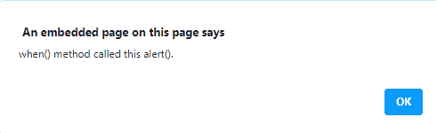
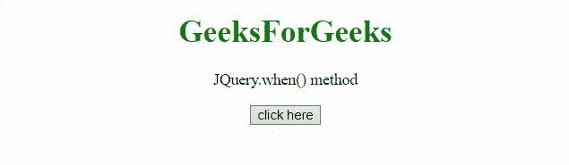

# jQuery `.promise()` 方法

> 原文: [https://www.geeksforgeeks.org/jquery-deferred-promise-method/](https://www.geeksforgeeks.org/jquery-deferred-promise-method/)

`.promise()` 方法在 jQuery 中返回一个 `Promise` 对象，当绑定到集合的某些类型操作结束时，无论是否排队，都要观察这个对象。

## 语法

```html
.promise([type][, target])
```

## 参数

*   `type`: 该参数指定需要观察的队列类型。
*   `target`: 该参数指定需要附加 `promise` 方法的对象。

## 返回值

这个方法返回一个动态生成的 `Promise`，一旦绑定到集合的动作完成，不管是否排队，这个 `Promise` 就会被解析。

下面讨论两个例子:

### 示例 1

在这个例子中，`Deferred()` 用于创建一个新对象，之后调用 `then()` 方法，并传入 `notify` 和 `resolve` 方法。

```html
<!DOCTYPE HTML> 
<html>  
<head>
    <title> 
      JQuery.when() method
    </title>
    <script src="https://code.jquery.com/jquery-3.5.0.js">
  </script> 
</head>   
<body style="text-align:center;">
    <h1 style="color:green">  
        GeeksForGeeks  
    </h1> 
    <p id="GFG_UP"> 
    </p>
    <button onclick = "Geeks();">
    click here
    </button>
    <p id="GFG_DOWN"> 
    </p>
    <script> 
        var el_up = document.getElementById("GFG_UP");
        el_up.innerHTML = "JQuery.when() method";
        var def = $.Deferred();
        function Geeks() {
            $.when().then(function(a) {
              alert( "when() method called this alert()." );
            });
        } 
     </script> 
</body>   
</html>        
```

**输出** :
**点击按钮前:**


**点击按钮后:**



### 示例 2

在这个例子中，使用了 `Deferred()` 方法，并检查了 `Deferred` 对象的状态。

```html
<!DOCTYPE HTML> 
<html>  
<head>
    <title> 
      JQuery.when() method
    </title>
     <script src="https://code.jquery.com/jquery-3.5.0.js">
</script> 
</head>   
<body style="text-align:center;">
    <h1 style="color:green">  
        GeeksForGeeks  
    </h1> 
    <p id="GFG_UP"> 
    </p>
    <button onclick = "Geeks();">
    click here
    </button>
    <p id="GFG_DOWN"> 
    </p>
    <script>
        var el_up = document.getElementById("GFG_UP");
        el_up.innerHTML = "JQuery.when() method";
        var def = $.Deferred();
        function Geeks() {
            $.when(def).done(function (x) {
              $('#GFG_DOWN').append('when() method is executed.')
            });
            def.resolve();
        } 
     </script> 
</body>   
</html>              
```

**输出:**
