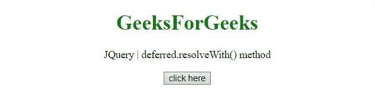

# jQuery deferred.resolveWith() 方法

> 原文: [https://www.geeksforgeeks.org/jquery-deferred-resolvewith-method/](https://www.geeksforgeeks.org/jquery-deferred-resolvewith-method/)

jQuery 中的 `deferred.resolveWith()` 方法用于解析一个 deferred 对象，并调用 done 回调以及给定的上下文和参数。

## 语法

```
deferred.resolveWith(context[, args])
```

## 参数

*   `context`: 这个参数是作为 `This` 对象传递给 done 回调的上下文。
*   `args`: 这个参数是一个可选的参数数组，它被传递给 done 回调。

## 返回值

此方法返回延迟对象。

下面讨论两个例子:

### 示例 1

在本例中，我们使用两个参数解析延迟对象，并处理任何 done 回调。

```html
<!DOCTYPE HTML> 
<html>  
<head> 
    <title> 
      jQuery | deferred.resolveWith() method
    </title> 
    <script src="https://code.jquery.com/jquery-3.5.0.js">
    </script> 
</head>   
<body style="text-align:center;">
    <h1 style="color:green;">  
        GeeksForGeeks  
    </h1> 
    <p id="GFG_UP"> 
    </p>
    <button onclick = "Geeks();">
    click here
    </button>
    <p id="GFG_DOWN"> 
    </p>
    <script> 
      var el_up = document.getElementById("GFG_UP");
      el_up.innerHTML = "jQuery | deferred.resolveWith() method";
      function Func(val, div){
        $(div).append(val);
      }
        function Geeks() {
            var def = $.Deferred();
            def.done(Func);
            def.resolveWith(this, ['Deferred is resolved by resolveWith() method.<br />', '#GFG_DOWN']);
        } 
    </script> 
</body>   
</html>       
```

**输出:**


### 示例 2

在本例中，我们仅使用一个参数解析延迟对象，并处理任何 done 回调。

```html
<!DOCTYPE HTML> 
<html>  
<head> 
    <title> 
      jQuery | deferred.resolveWith() method
    </title> 
    <script src="https://code.jquery.com/jquery-3.5.0.js">
    </script> 
</head>   
<body style="text-align:center;">
    <h1 style="color:green;">  
        GeeksForGeeks  
    </h1> 
    <p id="GFG_UP"> 
    </p>
    <button onclick = "Geeks();">
    click here
    </button>
    <p id="GFG_DOWN"> 
    </p>
    <script> 
        var el_up = document.getElementById("GFG_UP");
        el_up.innerHTML = 
             "jQuery | deferred.resolveWith() method";
        function Func(div){
          $(div).append(
              'Deferred is resolved by resolveWith() method');
        }
        function Geeks() {
            var def = $.Deferred();
            def.done(Func);
            def.resolveWith(this, ['#GFG_DOWN']);
        } 
    </script> 
</body>   
</html>       
```

**输出:**
