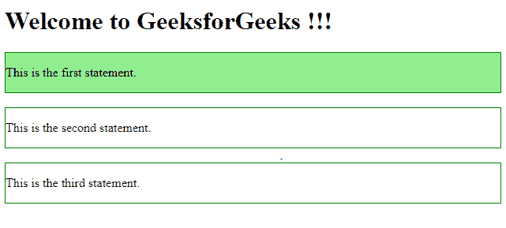
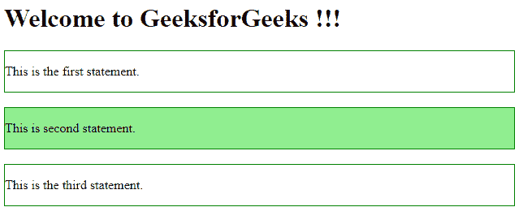

# jQuery `first()` 方法详解与示例

> 原文：[https://www.geeksforgeeks.org/jquery-first-with-examples/](https://www.geeksforgeeks.org/jquery-first-with-examples/)

## 概述
`first()` 是 jQuery 中的一个内置函数，用于从指定的元素集合中选择第一个元素。

## 语法
```javascript
$(selector).first()
```
这里的选择器是所有匹配元素的集合。

## 参数
该方法不接受任何参数。

## 返回值
返回包含所选元素中第一个元素的 jQuery 对象。

## 示例演示
以下 jQuery 代码展示了该函数的用法：

### 代码示例 #1
```html
<html>
<head>
    <script src="https://ajax.googleapis.com/ajax/libs/jquery/3.3.1/jquery.min.js"></script>
    <script>
        $(document).ready(function() {
            $("div").first().css("background-color", "lightgreen");
        });
    </script>
</head>
<body>
    <h1>Welcome to GeeksforGeeks !!!</h1>
    <div style="border: 1px solid green;">
        <p>This is the first statement.</p>
    </div>
    <br>
    <div style="border: 1px solid green;">
        <p>This is the second statement.</p>
    </div>
    <br>
    <div style="border: 1px solid green;">
        <p>This is the third statement.</p>
    </div>
    <br>
</body>
</html>
```
在上面的代码中，第一个 `div` 元素的背景色被改变了。

**输出：**


也可以通过选择所选元素的 `id` 或 `类` 来进行选择。

### 代码示例 #2
```html
<html>
<head>
    <script src="https://ajax.googleapis.com/ajax/libs/jquery/3.3.1/jquery.min.js"></script>
    <script>
        $(document).ready(function() {
            $(".main").first().css("background-color", "lightgreen");
        });
    </script>
</head>
<body>
    <h1>Welcome to GeeksforGeeks !!!</h1>
    <div style="border: 1px solid green;">
        <p>This is the first statement.</p>
    </div>
    <br>
    <div class="main" style="border: 1px solid green;">
        <p>This is second statement.</p>
    </div>
    <br>
    <div class="main" style="border: 1px solid green;">
        <p>This is the third statement.</p>
    </div>
    <br>
</body>
</html>
```
在上面的代码中，第一个具有 `main` 类的元素被突出显示。

**输出：**
