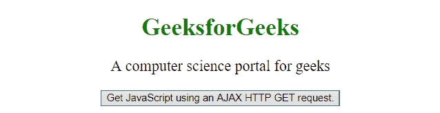
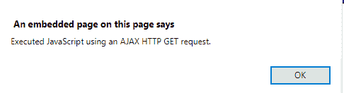
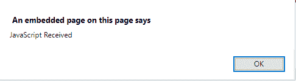

# jQuery getScript()方法

> 原文: [https://www.geeksforgeeks.org/jquery-getscript-method/](https://www.geeksforgeeks.org/jquery-getscript-method/)

jQuery 中的 `getScript()` 方法用于使用 AJAX HTTP GET 请求运行一个 JavaScript。

## 语法

```html
$(selector).getScript(url, success(response, status))
```

## 参数

包含两个参数，描述如下：

*   `url`: 必输参数。它持有请求发送到的 URL。
*   `success(response, status)`: 可选参数。如果请求成功，它保存要运行的函数。
    *   `response`: 保存请求的结果数据。
    *   `status`: 它保存请求的状态，如-"success"、"notmodified"、"error"、"timeout"或"parsererror"。

存储在服务器上的 `test.js` 文件，点击“更改内容”按钮后加载。

> **test.js**
> ```javascript
> alert("Using AJAX to get javaScript HTTP Get request");
> ```

## 示例 1

本示例显示了来自 AJAX HTTP GET 请求接收到的 JavaScript 的警报消息。

```html
<!DOCTYPE html>
<html>
    <head>
        <script src="https://ajax.googleapis.com/ajax/libs/jquery/3.3.1/jquery.min.js">
        </script>
        <script>
            $(document).ready(function() {
                $("button").click(function() {
                    $.getScript("test.js");
                });
            });
        </script>
    </head>
    <body style="text-align:center;">
        <h1 style="color: green;">GeeksforGeeks</h1>
        <p id="paragraph" style="font-size: 20px;">
            A computer science portal for geeks
        </p>
        <button>
            Get JavaScript using an AJAX HTTP GET request.
        </button>
    </body>
</html>
```

**输出:**

*   **之前点击按钮:**
    
*   **点击按钮后:**
    

## 示例 2

本示例使用 `getScript()` 方法显示警报消息。

```html
<!DOCTYPE html>
<html>
    <head>
        <script src="https://ajax.googleapis.com/ajax/libs/jquery/3.3.1/jquery.min.js">
        </script>
        <!-- Script to use getScript() Method -->
        <script>
            $(document).ready(function(){
                $("button").click(function(){
                    $.getScript("test.js", alert("JavaScript Received "));
                });
            });
        </script>
    </head>
    <body style="text-align:center;">
        <h1 style="color: green;">GeeksforGeeks</h1>
        <p id="paragraph" style="font-size: 20px;">
            A computer science portal for geeks
        </p>
        <button>
            Get JavaScript using an AJAX HTTP GET request.
        </button>
    </body>
</html>
```

**输出:**

*   **之前点击按钮:**
    
*   **点击按钮后:**
    
    