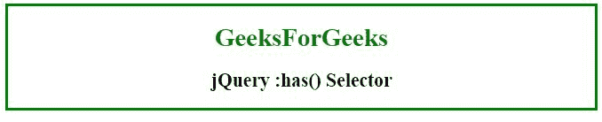

# jQuery :has()选择器

> 原文：[https://www.geeksforgeeks.org/jquery-has-selector-with-example/](https://www.geeksforgeeks.org/jquery-has-selector-with-example/)

jQuery 中的 `:has()` 选择器用于选择所有内部有一个或多个元素的元素，这些内部元素与指定的选择器匹配。

## 语法

```html
$(":has(selector)")
```

## 参数

该选择器包含单参数 `selector`，该参数是强制性的，用于指定要选择的元素。它还可以接受任何类型的选择器。

## 示例 1

本示例使用 `:has` 选择器选择包含 `<span>` 的 `<h2>` 元素，并为其创建实心绿色边框。

```html
<!DOCTYPE html>
<html>
   <head>
      <title>jQuery :has() Selector</title>

<script src=
"https://ajax.googleapis.com/ajax/libs/jquery/3.3.1/jquery.min.js">
      </script>

<!-- Script to use :has selector -->
      <script>
         $(document).ready(function(){
           $("h2:has(span)").css("border", "solid green");
         });
      </script>
   </head>

<body>
      <center>
         <h1 id="geeks1" style = "color:green;">GeeksForGeeks</h1>
         <h2 id="geeks2"><span>jQuery :has() Selector</span></h2>
      </center>
   </body>
</html>
```

**输出：**


## 示例 2

本示例使用 `:has` 选择器选择包含 `<h1>` 或 `<span>` 的 `<body>` 元素，并为其创建边框。

```html
<!DOCTYPE html>
<html>
   <head>
      <title>jQuery :has() Selector</title>

<script src=
"https://ajax.googleapis.com/ajax/libs/jquery/3.3.1/jquery.min.js">
      </script>

<!-- Script to use :has selector -->
      <script>
         $(document).ready(function(){
           $("body:has(h1, span)").css("border", "solid green");
         });
      </script>
   </head>

<body>
      <center>
         <h1 id="geeks1" style = "color:green;">GeeksForGeeks</h1>
         <h2 id="geeks2"><span>jQuery :has() Selector</span></h2>
      </center>
   </body>
</html>
```

**输出：**
