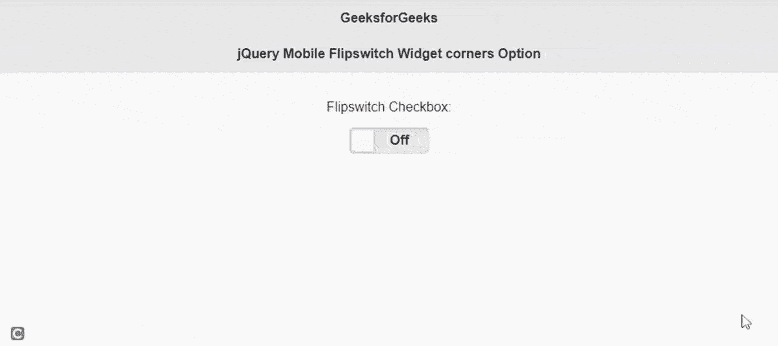

# jQuery Mobile Flipswitch Widget Corners Option

> 原文: [https://www.geeksforgeeks.org/jquery-mobile-flipswitch-widget-corners-option/](https://www.geeksforgeeks.org/jquery-mobile-flipswitch-widget-corners-option/)

jQuery Mobile 是一种基于网络的技术，用于制作可在所有智能手机、平板电脑和台式机上访问的响应内容。
在本文中，我们将使用 jQuery Mobile `flipswitch` Widget 的 `corners` 选项来设置 [CSS `border-radius` 属性](https://www.geeksforgeeks.org/css-border-radius-property/)。接受布尔类型值，默认值为 `true`。

**语法:**

```html
$( ".selector" ).flipswitch({
    corners: boolean
});
```

**CDN 链接:** 首先，添加项目所需的 jQuery Mobile 脚本。

```html
<link rel="stylesheet" href="//code.jquery.com/mobile/1.4.5/jquery.mobile-1.4.5.min.css">
<script src="//code.jquery.com/jquery-1.10.2.min.js"></script>
<script src="//code.jquery.com/mobile/1.4.5/jquery.mobile-1.4.5.min.js"></script>
```

**示例:**

## HTML

```html
<!doctype html>
<html lang="en">

<head>
    <meta charset="utf-8">
    <meta name="viewport" content="width=device-width, initial-scale=1">
    <link rel="stylesheet" href="//code.jquery.com/mobile/1.4.5/jquery.mobile-1.4.5.min.css">
    <script src="//code.jquery.com/jquery-1.10.2.min.js"></script>
    <script src="//code.jquery.com/mobile/1.4.5/jquery.mobile-1.4.5.min.js"></script>
    <script>
        $(document).ready(function () {
            $("#GFG").flipswitch({
                corners: false
            });
        });
    </script>
</head>

<body>
    <div data-role="page" id="page1">
        <div data-role="header">
            <h1>GeeksforGeeks</h1>
            <h3>jQuery Mobile Flipswitch Widget corners Option</h3>
        </div>
        <div class="ui-field-contain">
            <form>
                <div data-role="fieldcontain">
                    <center>
                        <label for="GFG">Flipswitch Checkbox:</label>
                        <input type="checkbox" id="GFG" data-role="flipswitch">
                    </center>
                </div>
            </form>
        </div>
    </div>
</body>

</html>
```

**输出:**


Flipswitch Checkbox corners 设置为 `false`

**注意:** 在上面的代码中，如果 `corners` 选项设置为 `true`，那么我们得到如下输出。您可以注意到 flipswitch 复选框角落的差异。

**输出:**



Flipswitch Checkbox corners 设置为 `true`

**参考:** [https://api.jquerymobile.com/flipswitch/#option-corners](https://api.jquerymobile.com/flipswitch/#option-corners)