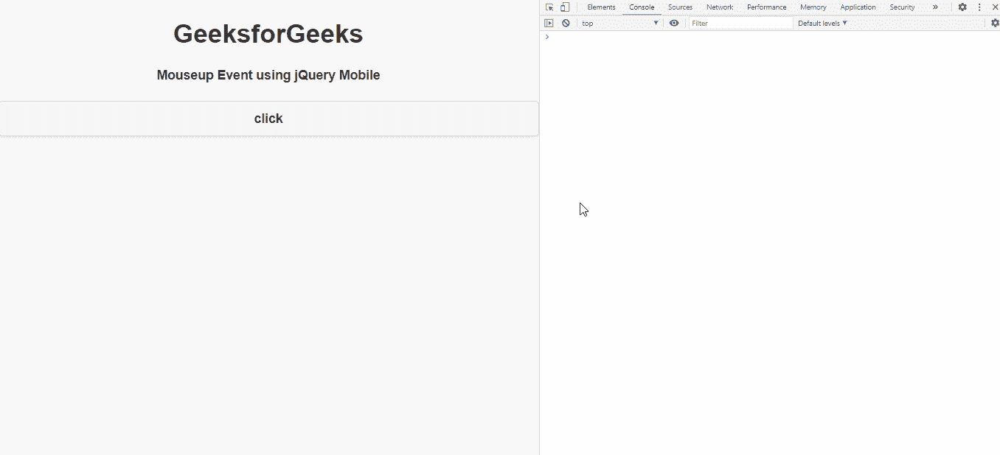
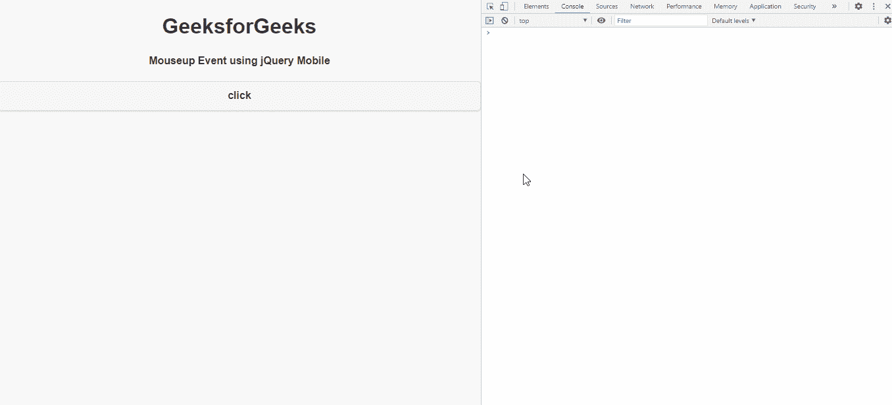

# jQuery Mobile vmouseup 事件

> 原文: [https://www.geeksforgeeks.org/jquery-mobile-vmouseup-event/](https://www.geeksforgeeks.org/jquery-mobile-vmouseup-event/)

`jQuery Mobile` 当我们在元素上点击并释放鼠标时，会触发 `vmouseup` 事件。我们可以将这个事件用于不同的目的。

**语法:**

```html
jQuery(".selector").on( "vmouseup", function( event ) {  } )
```

**方法:** 首先，添加项目所需的 `jQuery Mobile` 脚本。

```html
<link rel="stylesheet" href="http://code.jquery.com/mobile/1.4.5/jquery.mobile-1.4.5.min.css"/>
<script src="http://code.jquery.com/jquery-1.11.1.min.js"></script>
<script src="http://code.jquery.com/mobile/1.4.5/jquery.mobile-1.4.5.min.js"></script>
```

### 示例 1

```html
<!DOCTYPE html>
<html>

<head>
    <link rel="stylesheet" href=
"http://code.jquery.com/mobile/1.4.5/jquery.mobile-1.4.5.min.css" />

<script src=
        "http://code.jquery.com/jquery-1.11.1.min.js">
    </script>

<script src=
"http://code.jquery.com/mobile/1.4.5/jquery.mobile-1.4.5.min.js">
    </script>

<script type="text/javascript">
        $(document).on('vmouseup', 'a', function () {
            console.log('mouseup event fired');
        });
    </script>
</head>

<body>
    <center>
        <h1>GeeksforGeeks</h1>
        <h4>
            Mouseup Event using
            jQuery Mobile
        </h4>
    </center>

<a data-role="button" id="gfg">click</a>
</body>

</html>
```

**输出:**



### 示例 2

```html
<!DOCTYPE html>
<html>

<head>
    <link rel="stylesheet" href=
"http://code.jquery.com/mobile/1.4.5/jquery.mobile-1.4.5.min.css" />

<script src=
        "http://code.jquery.com/jquery-1.11.1.min.js">
    </script>

<script src=
"http://code.jquery.com/mobile/1.4.5/jquery.mobile-1.4.5.min.js">
    </script>

<script type="text/javascript">
        $(document).on('vmouseup', 'a',
            function (event) {
                console.log(event);
            });
    </script>
</head>

<body>
    <center>
        <h1>GeeksforGeeks</h1>
        <h4>
            Mouseup Event using
            jQuery Mobile
        </h4>
    </center>
    <a data-role="button" id="gfg">click</a>
</body>

</html>
```

**输出:**

