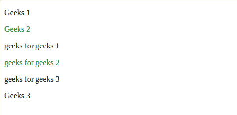
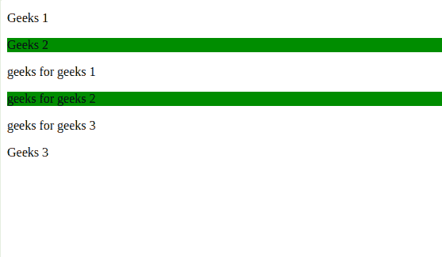
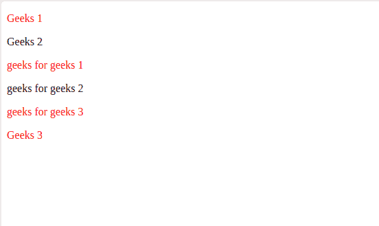
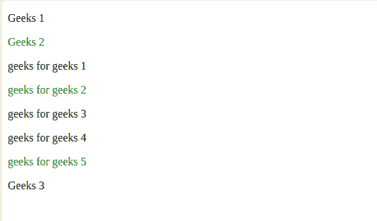

# jQuery :nth-of-type()选择器

> 原文: [https://www.geeksforgeeks.org/jquery-nth-of-type-selector/](https://www.geeksforgeeks.org/jquery-nth-of-type-selector/)

`:nth-of-type()` 是 jQuery 中的内置选择器，用于选择指定父元素的所有第 n 个子元素。

## 语法

```html
parent_name :nth-of-type(n|even|odd|algebraic equation)
```

## 参数

取一个参数 `n` | `even` | `odd` | `algebraic equation`。

| 值 | 描述 |
| :--- | :--- |
| `n` | 选择出现在第 n 个索引处的子元素（从 1 开始）。N 必须是整数。 |
| `even` | 选择出现在偶数索引处的子元素。 |
| `odd` | 选择出现在奇数索引处的子元素。 |
| `algebraic equation` | 选择出现在方程值处的子元素。方程应为 `mn+c` 或 `Mn–C` 类型，其中 M 和 C 是常量值。 |

**注：**
*   不同部分或分区中的子元素被区别对待，即索引从开始开始。
*   在 `mn + c` 中，n 从值 0 开始。

## 示例-1：使用 `n` 作为参数

```html
<!DOCTYPE html>
<html>
<head>
    <script src="https://ajax.googleapis.com/ajax/libs/jquery/3.3.1/jquery.min.js"></script>
    <script>
        $(document).ready(function() {
            $("p:nth-of-type(2)").css("color", "green");
        });
    </script>
</head>
<body>
<p>Geeks 1</p>
<p>Geeks 2</p>
<section>
    <!--Indices of child elements start from beginning inside new section-->
    <p>geeks for geeks 1</p>
    <p>geeks for geeks 2</p>
    <p>geeks for geeks 3</p>
</section>
<!--Outside the section the index of the child element remain same as before section tag-->
<p>Geeks 3</p>
</body>
</html>
```

**输出：**



在上面的示例中，索引 2 处的子元素（父元素是 `p` 标记）被格式化为绿色，即“Geeks 2”和“geeks for geeks 2”。

## 示例-2：使用 `even` 作为参数

```html
<!DOCTYPE html>
<html>
<head>
    <script src="https://ajax.googleapis.com/ajax/libs/jquery/3.3.1/jquery.min.js"></script>
    <script>
        $(document).mouseover(function() {
            $("p:nth-of-type(even)").css("background-color", "green");
        });
    </script>
</head>
<body>
<p>Geeks 1</p>
<p>Geeks 2</p>
<section>
    <!--Indices of child elements start from beginning inside new section-->
    <p>geeks for geeks 1</p>
    <p>geeks for geeks 2</p>
    <p>geeks for geeks 3</p>
</section>
<!--Outside the section the index of the child element remain same as before section tag-->
<p>Geeks 3</p>
</body>
</html>
```

**输出：**



在上面的例子中，偶数索引处的子元素（父元素是 `p` 标记）被格式化为绿色背景，即“Geeks 2”和“geeks for geeks 2”。

## 示例-3：使用 `odd` 作为参数

```html
<!DOCTYPE html>
<html>
<head>
    <script src="https://ajax.googleapis.com/ajax/libs/jquery/3.3.1/jquery.min.js"></script>
    <script>
        $(document).mouseover(function() {
            $("p:nth-of-type(odd)").css("color", "red");
        });
    </script>
</head>
<body>
<p>Geeks 1</p>
<p>Geeks 2</p>
<section>
    <!--Indices of child elements start from beginning inside new section-->
    <p>geeks for geeks 1</p>
    <p>geeks for geeks 2</p>
    <p>geeks for geeks 3</p>
</section>
<!--Outside the section the index of the child element remain same as before section tag-->
<p>Geeks 3</p>
</body>
</html>
```

**输出：**



在上面的例子中，奇数索引处的子元素（父元素是 `p` 标记）被格式化为红色，即“Geeks 1”、“geeks for geeks 1”、“geeks for geeks 3”和“Geeks 3”。

## 示例-4：使用 `algebraic equation` 作为参数

```html
<!DOCTYPE html>
<html>
<head>
    <script src="https://ajax.googleapis.com/ajax/libs/jquery/3.3.1/jquery.min.js"></script>
    <script>
        $(document).mouseover(function() {
            $("p:nth-of-type(3n+2)").css("color", "green");
        });
    </script>
</head>
<body>
<p>Geeks 1</p>
<p>Geeks 2</p>
<section>
    <!--Indices of child elements start from beginning inside new section-->
    <p>geeks for geeks 1</p>
    <p>geeks for geeks 2</p>
    <p>geeks for geeks 3</p>
    <p>geeks for geeks 4</p>
    <p>geeks for geeks 5</p>
</section>
<!--Outside the section the index of the child element remain same as before section tag-->
<p>Geeks 3</p>
</body>
</html>
```

**输出：**



在上面的例子中，索引值等于 `3n + 2`（父元素是 `p` 标记）的子元素被格式化为绿色，即“Geeks 2”、“geeks for geeks 2”、“geeks for geeks 5”。