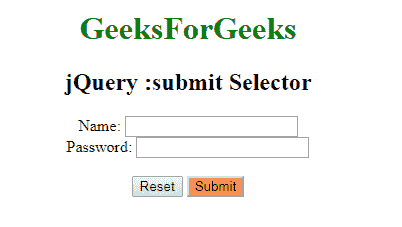

# jQuery :submit 选择器

> 原文: [https://www.geeksforgeeks.org/jquery-submit-selector/](https://www.geeksforgeeks.org/jquery-submit-selector/)

**:submit** 选择器是一个内置的 jQuery 选择器，用于选择提交按钮和类型为 `submit` 的输入元素。如果按钮的 `type` 属性未定义，大多数标准浏览器会将其默认为 `type="submit"`。

## 语法

```html
$(":submit")
```

## 示例

```html
<!DOCTYPE html>
<html>

<head>
    <script src="https://ajax.googleapis.com/ajax/libs/jquery/3.3.1/jquery.min.js"></script>
    <script>
        $(document).ready(function() {
            $(":submit").css("background-color", "coral");
        });
    </script>
</head>

<body>
    <center>
        <h1 style="color:green;">GeeksForGees</h1>
        <h2>jQuery :submit Selector</h2>
        <form action="#">
            Name:
            <input type="text" name="user">
            <br> Password:
            <input type="password" name="password">
            <br>
            <br>
            <input type="reset" value="Reset">
            <input type="submit" value="Submit">
            <br>
        </form>
    </center>
</body>

</html>
```

## 输出



## 支持的浏览器

支持 jQuery `:submit` 选择器的浏览器如下：

*   谷歌 Chrome
*   微软 Internet Explorer
*   火狐浏览器
*   Opera
*   Safari