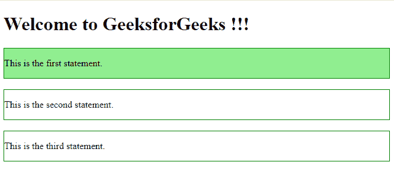
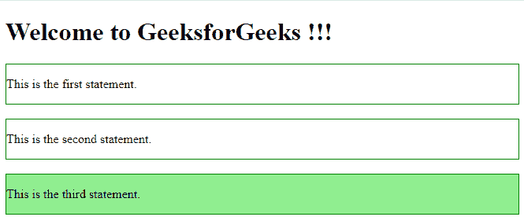
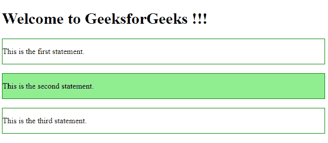
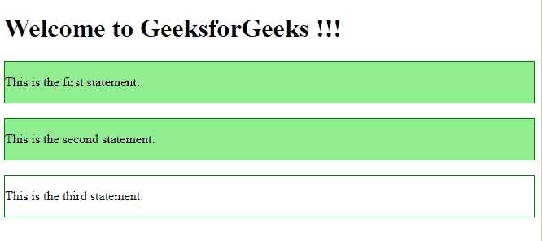
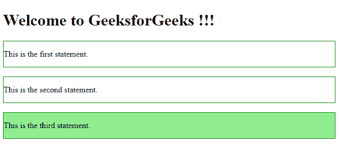

# jQuery 遍历过滤

> 原文: [https://www.geeksforgeeks.org/jquery-traversing-filtering/](https://www.geeksforgeeks.org/jquery-traversing-filtering/)

jQuery 中的遍历过滤用于根据 HTML 元素与其他元素的关系来查找它们。过滤是 jQuery 中的一个过程，用于允许在有条件或无条件的情况下找到特定的元素。有五种基本类型的过滤方法可用于选择下面列出的元素：

*   `first()` 方法
*   `last()` 方法
*   `eq()` 方法
*   `filter()` 方法
*   `not()` 方法

## first() 方法

`first()` 方法在 jQuery 中用于从一组元素中选择第一个元素。

**语法：**

```html
$(selector).first()
```

**参数：** 不接受任何参数。

**返回值：** 返回所选元素中的第一个元素。

**示例：**

```html
<!DOCTYPE html>
<html>
<head>
    <title>
        jQuery first() method
    </title>
    <script src="https://ajax.googleapis.com/ajax/libs/jquery/3.3.1/jquery.min.js">
    </script>
    <!-- Script to use first() method -->
    <script>
        $(document).ready(function() {
            $("div").first().css("background-color", "lightgreen");
        });
    </script>
</head>
<body>
    <h1>Welcome to GeeksforGeeks !!!</h1>
    <div style="border: 1px solid green;">
        <p>This is the first statement.</p>
    </div>
    <br>
    <div style="border: 1px solid green;">
        <p>This is the second statement.</p>
    </div>
    <br>
    <div style="border: 1px solid green;">
        <p>This is the third statement.</p>
    </div>
    <br>
</body>
</html>
```

**输出：**


## last() 方法

`last()` 方法在 jQuery 中用于查找一组元素中的最后一个元素。

**语法：**

```html
$(selector).last()
```

**参数：** 不接受任何参数。

**返回值：** 返回所选元素中的最后一个元素。

**示例：**

```html
<!DOCTYPE html>
<html>
<head>
    <script src="https://ajax.googleapis.com/ajax/libs/jquery/3.3.1/jquery.min.js">
    </script>
    <!-- Script to use last() method -->
    <script>
        $(document).ready(function() {
            $("div").last().css("background-color", "lightgreen");
        });
    </script>
</head>
<body>
    <h1>Welcome to GeeksforGeeks !!!</h1>
    <div style="border: 1px solid green;">
        <p>This is the first statement.</p>
    </div>
    <br>
    <div style="border: 1px solid green;">
        <p>This is the second statement.</p>
    </div>
    <br>
    <div style="border: 1px solid green;">
        <p>This is the third statement.</p>
    </div>
    <br>
</body>
</html>
```

**输出：**


## eq() 方法

此方法用于选择具有特定索引号的元素。

**语法：**

```html
$(selector).eq(index_number)
```

**参数：** 取指定元素的索引号。

**返回值：** 返回所选元素中具有特定索引号的元素。

**示例：**

```html
<!DOCTYPE html>
<html>
<head>
    <script src="https://ajax.googleapis.com/ajax/libs/jquery/3.3.1/jquery.min.js">
    </script>
    <!-- Script to use eq() method -->
    <script>
        $(document).ready(function() {
            $("div").eq(1).css("background-color", "lightgreen");
        });
    </script>
</head>
<body>
    <h1>Welcome to GeeksforGeeks !!!</h1>
    <div style="border: 1px solid green;">
        <p>This is the first statement.</p>
    </div>
    <br>
    <div style="border: 1px solid green;">
        <p>This is the second statement.</p>
    </div>
    <br>
    <div style="border: 1px solid green;">
        <p>This is the third statement.</p>
    </div>
    <br>
</body>
</html>
```

**输出：**


## filter() 方法

此方法用于根据一些特定条件选择元素。

**语法：**

```html
$(selector).filter(parameter)
```

**参数：** 从另一个具有相同元素名称的元素中过滤指定的元素需要一个类名或 id 名。

**返回值：** 返回所有符合条件的元素。

**示例：**

```html
<!DOCTYPE html>
<html>
<head>
    <script src="https://ajax.googleapis.com/ajax/libs/jquery/3.3.1/jquery.min.js">
    </script>
    <!-- Script to use filter() method -->
    <script>
        $(document).ready(function() {
            $("div").filter(".demo").css("background-color", "lightgreen");
        });
    </script>
</head>
<body>
    <h1>Welcome to GeeksforGeeks !!!</h1>
    <div class="demo" style="border: 1px solid green;">
        <p>This is the first statement.</p>
    </div>
    <br>
    <div class="demo" style="border: 1px solid green;">
        <p>This is the second statement.</p>
    </div>
    <br>
    <div style="border: 1px solid green;">
        <p>This is the third statement.</p>
    </div>
    <br>
</body>
</html>
```

**输出：**


## not() 方法

此方法用于选择所有不符合某些条件的元素。

**语法：**

```html
$(selector).not(parameter)
```

**参数：** 需要类名或 id 名才能从其他具有相同元素名的元素中取消选择。

**返回值：** 返回所有不符合条件的元素。

**示例：**

```html
<!DOCTYPE html>
<html>
<head>
    <script src="https://ajax.googleapis.com/ajax/libs/jquery/3.3.1/jquery.min.js">
    </script>
    <!-- Script to use not() method -->
    <script>
        $(document).ready(function() {
            $("div").not(".demo").css("background-color", "lightgreen");
        });
    </script>
</head>
<body>
    <h1>Welcome to GeeksforGeeks !!!</h1>
    <div class="demo" style="border: 1px solid green;">
        <p>This is the first statement.</p>
    </div>
    <br>
    <div class="demo" style="border: 1px solid green;">
        <p>This is the second statement.</p>
    </div>
    <br>
    <div style="border: 1px solid green;">
        <p>This is the third statement.</p>
    </div>
    <br>
</body>
</html>
```

**输出：**
