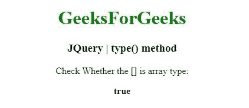
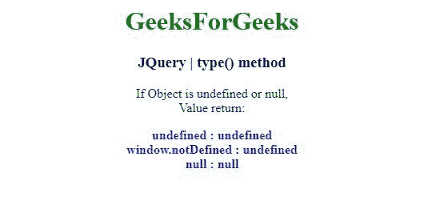

# jQuery | type()方法

> 原文: [https://www.geeksforgeeks.org/jquery-type-method/](https://www.geeksforgeeks.org/jquery-type-method/)

jQuery 中的这个 `type()` 方法用于确定一个对象的内部 JavaScript [[Class]]。

## 语法:

```html
jQuery.type( obj )
```

## 参数:

`type()`方法只接受上面提到的一个参数，如下所述:

*   `obj`: 这个参数是获取内部 JavaScript [[Class]]的对象。

## 返回值:

返回字符串。

*   `jQuery.type(true) === "boolean"`
*   `jQuery.type( new Boolean() ) === "boolean"`
*   `jQuery.type( 3 ) === "number"`
*   `jQuery.type( new Number(3) ) === "number"`
*   `jQuery.type(undefined) === "undefined"`
*   `jQuery.type() === "undefined"`
*   `jQuery.type(window.notDefined) === "undefined"`
*   `jQuery.type(null) === "null"`
*   `jQuery.type( "test" ) === "string"`
*   `jQuery.type( new String("test") ) === "string"`
*   `jQuery.type(function(){ }) === "function"`
*   `jQuery.type( [] ) === "array"`
*   `jQuery.type( new Array() ) === "array"`
*   `jQuery.type( new Date() ) === "date"`
*   `jQuery.type( new Error() ) === "error"`
*   `jQuery.type( Symbol() ) === "symbol"`
*   `jQuery.type( Object(Symbol()) ) === "symbol"`
*   `jQuery.type( /test/ ) === "regexp"`

## 例 1:

在本例中， `type()`方法检查参数是否为数组。

```html
<!DOCTYPE html>
<html>
<head>
<meta charset="utf-8">
<title>JQuery | type() method</title>
<script src="https://code.jquery.com/jquery-3.4.1.js"></script>
<style>
    div {
        color: blue;
    }
</style>
</head>
<body style="text-align:center;">
<h1 style="color: green">
    GeeksForGeeks
</h1>
<h3>JQuery | type() method</h3>
<p> Check Whether the [] is array type:</p>
<b></b>
<script>
$( "b" ).append( "" + jQuery.type( [] ) === "array");
</script>
</body>
</html>
```

**输出:**


## 例 2:

在本例中， `type()`方法对象未定义或为空。

```html
<!DOCTYPE html>
<html>
<head>
<meta charset="utf-8">
<title>JQuery | type() method</title>
<script src="https://code.jquery.com/jquery-3.4.1.js"></script>
<style>
    b {
        color: blue;
    }
</style>
</head>
<body style="text-align:center;">
<h1 style="color: green">
    GeeksForGeeks
</h1>
<h3>JQuery | type() method</h3>
<p> If Object is undefined or null, <br>Value return:</p>
<b></b>
<script>
$( "b" ).append("undefined : " + jQuery.type( undefined )+ "<br>"+
"window.notDefined  : " + jQuery.type(window.notDefined )+ "<br>"+
"null  : " + jQuery.type( null  )+ "<br>"
);
</script>
</body>
</html>
```

**输出:**
