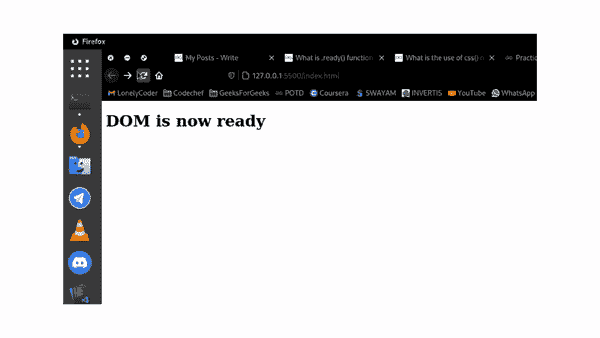

# ready()函数在jQuery中有什么用？

> 原文：[https://www.geeksforgeeks.org/what-is-the-use-of-ready-function-in-jquery/](https://www.geeksforgeeks.org/what-is-the-use-of-ready-function-in-jquery/)

在本文中，我们将看到如何使用[jQuery库](https://www.geeksforgeeks.org/jquery-introduction/)提供的 [`ready()`](https://www.geeksforgeeks.org/jquery-ready-with-examples/) 功能。[`ready()`](https://www.geeksforgeeks.org/jquery-ready-with-examples/) 函数仅在HTML DOM完全加载时用于执行一些javascript代码。在DOM完全加载之前，我们不应该操作它。[`ready()`](https://www.geeksforgeeks.org/jquery-ready-with-examples/) 方法检测DOM何时加载成功非常方便。

**语法：**

```html
$(selector).ready(handler)
```

这里的“处理程序”是一个JavaScript函数，一旦DOM准备好了，它就会被执行。括号内的选择器无关紧要。例如，下面三种语法的意思是一样的。

**示例：** 在下面的示例中，我们在`ready()`函数的帮助下，将`h1`的文本更改为“DOM现在准备好了”，该函数在DOM完全加载时触发。

## 示例

```html
<!DOCTYPE html>
<html>
<head>
    <script src="https://ajax.googleapis.com/ajax/libs/jquery/3.5.1/jquery.min.js">
    </script>
</head>
<body>
    <h1></h1>
    <script>
        $.holdReady(true);
        setTimeout(() => {
            $.holdReady(false);
        }, 2000);
        function onDOMReady() {
            $().ready(() => {
                $("h1").text("DOM is now ready");
            });
        }
        onDOMReady();
    </script>
</body>
</html>
```

**输出：** 这里我们使用`holdReady()`函数来保持DOM ready事件2秒，这样我们就可以模拟DOM加载的延迟来测试 [`ready()`](https://www.geeksforgeeks.org/jquery-ready-with-examples/) 函数。

