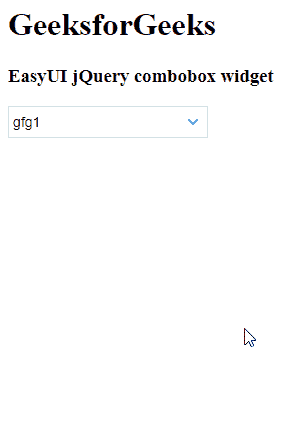

# Easy UI jQuery Combobox Widget

> 哎哎哎:# t0]https://www . geeksforgeeks . org/easy ui-jquery combobox widget/

EasyUI 是一个 HTML5 框架，用于使用基于 jQuery、React、Angular 和 Vue 技术的用户界面组件。它有助于构建交互式 web 和移动应用程序的功能，为开发人员节省了大量时间。

在本文中，我们将学习如何使用 jQuery EasyUI 设计一个组合框。组合框显示一个可编辑的文本框和下拉列表，用户可以从中选择一个或多个值。

**jQuery Easy UI 下载:**
```
https://www.jeasyui.com/download/index.php
```

## 语法
```html
<input class="easyui-combobox">
```

### 属性
- `valueField`: 要绑定到此组合框的基础数据值名称。
- `textField`: 要绑定到此组合框的基础数据字段名称。
- `groupField`: 指示要分组的字段。
- `groupFormatter`: 返回要在组项目上显示的组文本。
- `mode`: 定义文本改变时如何加载列表数据。
- `url`: 从远程加载列表数据的网址。
- `method`: 检索数据的 http 方法。
- `data`: 待加载的列表数据。
- `queryParams`: 请求远程数据时将发送到服务器的附加参数。
- `limitToList`: 为真，将输入值限制在列出的项目。
- `showItemIcon`: 为真，在文本框中显示所选项目的图标。
- `groupPosition`: 项目组位置。
- `filter`: 定义当`mode`设置为`local`时，如何过滤本地数据。
- `formatter`: 定义如何渲染行。
- `loader`: 定义如何从远程服务器加载数据。返回`false`可以中止此操作。
- `loadFilter`: 返回过滤后的数据进行显示。

### 事件
- `onBeforeLoad`: 在请求加载数据之前激发。
- `onLoadSuccess`: 远程数据加载成功时触发。
- `onLoadError`: 加载远程数据时出现错误时触发。
- `onChange`: 当字段值改变时触发。
- `onClick`: 当用户点击列表项时触发。
- `onSelect`: 当用户选择列表项时触发。
- `onUnselect`: 当用户取消选择列表项时触发。

### 方法
- `options`: 返回选项对象。
- `getData`: 返回加载的数据。
- `loadData`: 加载地区列表数据。
- `reload`: 请求远程列表数据。
- `setValues`: 设置组合框值数组。
- `setValue`: 设置组合框值。
- `clear`: 清除组合框值。
- `select`: 选择指定项目。
- `unselect`: 取消选择指定的项目。

## CDN 链接
首先，添加项目所需的 jQuery Easy UI 脚本。
```html
<!-- jQuery 的 EasyUI 库 -->
<script type="text/javascript" src="jquery.easyui.min.js">
</script>
```

## 示例

### HTML
```html
<!doctype html> 
<html>

<head> 
    <meta charset="UTF-8"> 
    <meta name="viewport" content="initial-scale=1.0, 
        maximum-scale=1.0, user-scalable=no">

    <!-- EasyUI specific stylesheets-->
    <link rel="stylesheet" type="text/css"
        href="themes/metro/easyui.css">

    <link rel="stylesheet" type="text/css"
        href="themes/mobile.css">

    <link rel="stylesheet" type="text/css"
        href="themes/icon.css">

    <!-- jQuery library -->
    <script type="text/javascript" src="jquery.min.js"> 
    </script>

    <!-- jQuery libraries of EasyUI -->
    <script type="text/javascript"
        src="jquery.easyui.min.js"> 
    </script>

    <!-- jQuery library of EasyUI Mobile -->
    <script type="text/javascript"
        src="jquery.easyui.mobile.js"> 
    </script>

    <script type="text/javascript"> 
      $(document).ready(function (){ 
          $('#gfg').combobox({ 
            valueField: 'value',
            textField: 'text'
          }); 
      }); 
    </script> 
</head>

<body>

    <h1>GeeksforGeeks</h1>
    <h3>EasyUI jQuery combobox widget</h3>
    <select id="gfg" class="easyui-combobox" 
            name="dept" style="width:200px;">
      <option>gfg1</option>
      <option>gfg2</option>
      <option>gfg3</option>
      <option>gfg4</option>
      <option>gfg5</option>
    </select>
</body>
</html>
```

### 输出


**参考:** http://www.jeasyui.com/documentation/