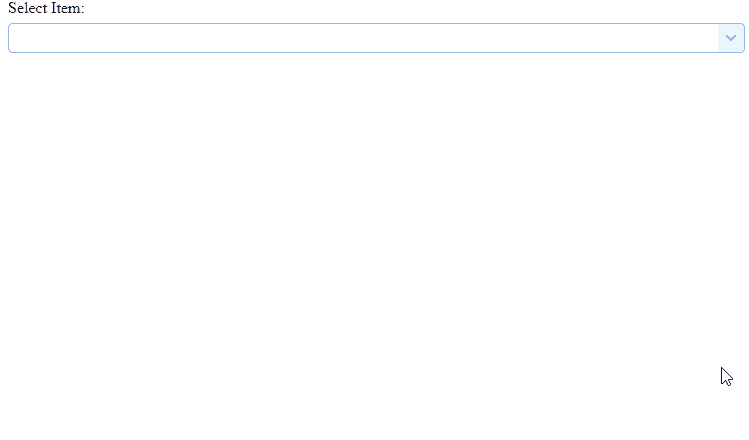

# Easy UI jQuery Combogrid Widget

> 哎哎哎:# t0]https://www . geeksforgeeks . org/easy ui-jquery-combogrid 小部件/

EasyUI 是一个 HTML5 框架，用于使用基于 jQuery、React、Angular 和 Vue 技术的用户界面组件。它有助于构建交互式 web 和移动应用程序的功能，为开发人员节省了大量时间。

在本文中，我们将学习如何使用 jQuery EasyUI 设计一个组合网格。`combogrid` 将可编辑文本框与下拉数据网格面板相结合，用户可以从中快速查找和选择。

### jQuery 易 UI 下载:
`https://www.jeasyui.com/download/index.php`

### 语法:
```html
<input class="easyui-combogrid">
```

### 属性:
- `loadMsg`: data grid 加载远程数据时显示的消息。
- `idField`: id 字段名。
- `textField`: 要在文本框中显示的文本字段。
- `mode`: 定义文本改变时如何加载数据网格数据。
- `filter`: 定义当“模式”设置为“本地”时，如何选择本地数据。

### 方法:
- `options()`: 返回选项对象。
- `grid()`: 返回 datagrid 对象。
- `setValue()`: 设置组件值。
- `setValues()`: 设置组件值数组。
- `clear()`: 清除组件值。

### 实现步骤:
首先，添加项目所需的 jQuery Easy UI 脚本。
```html
<link rel="stylesheet" type="text/css" href="https://www.jeasyui.com/easyui/themes/default/easyui.css">
<link rel="stylesheet" type="text/css" href="https://www.jeasyui.com/easyui/themes/icon.css">
<script type="text/javascript" src="https://www.jeasyui.com/easyui/jquery.min.js"></script>
<script type="text/javascript" src="https://www.jeasyui.com/easyui/jquery.easyui.min.js"></script>
```

### 示例:
## HTML
```html
<html>
<head>    
    <link rel="stylesheet" type="text/css" 
        href="https://www.jeasyui.com/easyui/themes/default/easyui.css">
<link rel="stylesheet" type="text/css" 
        href="https://www.jeasyui.com/easyui/themes/icon.css">
<script type="text/javascript" 
        src="https://www.jeasyui.com/easyui/jquery.min.js"></script>
<script type="text/javascript" 
        src="https://www.jeasyui.com/easyui/jquery.easyui.min.js"></script>
</head>
<body>
    <div style="margin-bottom:20px">
            <select class="easyui-combogrid" style="width:100%" data-options="
                    panelWidth: 500,
                    idField: 'itemid',
                    textField: 'productname',
                    method: 'get',
                    columns: [[
                        {field:'itemid',title:'Item ID',width:80},
                        {field:'productname',title:'Product',width:120},
                        {field:'listprice',title:'List Price',
                            width:80,align:'right'},
                        {field:'unitcost',title:'Unit Cost',
                            width:80,align:'right'},
                        {field:'attr1',title:'Attribute',width:200},
                        {field:'status',title:'Status',
                            width:60,align:'center'}
                    ]],
                    fitColumns: true,
                    label: 'Select Item:',
                    labelPosition: 'top'
                ">
            </select>
        </div>
</body>
</html>
```

### 输出:


### 参考:
`http://www.jeasyui.com/documentation/`