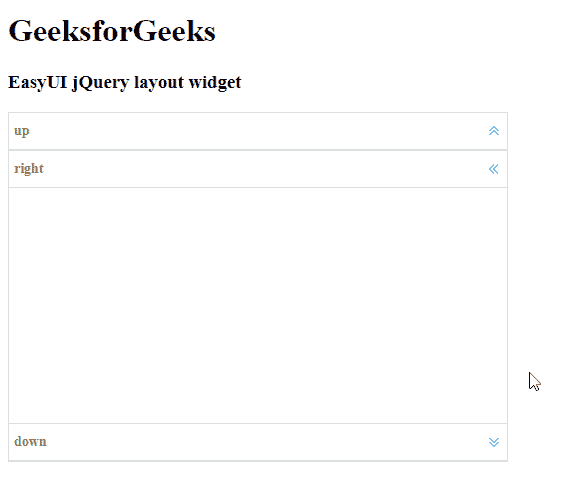

# Easy UI jQuery Layout Widget

> 哎哎哎::1230【https://www . geeksforgeeks . org/easy ui-jquery 布局小部件/

EasyUI 是一个 HTML5 框架，用于使用基于 jQuery、React、Angular 和 Vue 技术的用户界面组件。它有助于构建交互式 web 和移动应用程序的功能，为开发人员节省了大量时间。

在本文中，我们将学习如何使用 jQuery EasyUI 设计布局。布局为容器，最多有*北、南、东、西*和*中心*五个区域。中心区域面板是必需的，但边缘区域面板是可选的。

## jQuery EasyUI 下载

`https://www.jeasyui.com/download/index.php`

## 语法

```html
<div class="layout"></div>
```

## 布局选项

*   `fit`: 如果设置为`true`，则设置布局大小以适应其父容器。

## 区域面板选项

*   `title`: 布局面板标题文本。
*   `region`: 定义布局面板位置。
*   `border`: 设置为`true`显示布局面板边框。
*   `split`: 设置为`true`显示一个拆分条，用户可以在其中更改面板大小。
*   `iconCls`: 图标 CSS 类，用于在面板标题上显示图标。
*   `href`: 从远程服务器加载数据的网址。
*   `collapsible`: 定义是否显示可折叠按钮。
*   `minWidth`: 最小面板宽度。
*   `minHeight`: 最小面板高度。
*   `maxWidth`: 最大面板宽度。
*   `maxHeight`: 最大面板高度。
*   `expandMode`: 点击折叠面板时的展开模式。
*   `collapseSize`: 折叠后的面板尺寸。
*   `hideExpandTool`: 设置为`true`以隐藏折叠面板上的展开工具。
*   `hideCollapsedContent`: 设置为`true`隐藏折叠面板上的标题栏。
*   `collapsedContent`: 要在折叠面板上显示的标题内容。

## 事件

*   `onCollapse`: 折叠区域面板时事件触发。
*   `onExpand`: 事件在展开区域面板时触发。
*   `onAdd`: 添加新的区域面板时事件触发。
*   `onRemove`: 移除区域面板时事件触发。

### 方法

*   `resize`: 设置布局大小。
*   `panel`: 返回指定面板。
*   `collapse`: 折叠指定的面板。
*   `expand`: 展开指定面板。
*   `add`: 添加指定面板。
*   `remove`: 移除指定面板。
*   `split`: 分割区域面板。
*   `unsplit`: 取消分割区域面板。
*   `stopCollapsing`: 停止折叠区域面板。

## 使用方法

首先，添加项目所需的 jQuery EasyUI 脚本。

```html
<script type="text/javascript" src="jquery.easyui.min.js"></script>
<script type="text/javascript" src="jquery.easyui.mobile.js"></script>
```

## 示例

```html
<!doctype html>
<html>
<head>
    <meta charset="UTF-8">
    <meta name="viewport" content="initial-scale=1.0, maximum-scale=1.0, user-scalable=no">
    <!-- EasyUI specific stylesheets-->
    <link rel="stylesheet" type="text/css" href="themes/metro/easyui.css">
    <link rel="stylesheet" type="text/css" href="themes/mobile.css">
    <link rel="stylesheet" type="text/css" href="themes/icon.css">
    <!--jQuery library -->
    <script type="text/javascript" src="jquery.min.js"></script>
    <!--jQuery libraries of EasyUI -->
    <script type="text/javascript" src="jquery.easyui.min.js"></script>
    <!--jQuery library of EasyUI Mobile -->
    <script type="text/javascript" src="jquery.easyui.mobile.js"></script>
    <script type="text/javascript">
        $(document).ready(function() {
            $('#gfg').layout('show', {});
        });
    </script>
</head>
<body>
    <h1>GeeksforGeeks</h1>
    <h3>EasyUI jQuery layout widget</h3>
    <div id="gfg" class="easyui-layout" style="width:500px;height:350px;">
        <div data-options="region:'north',title:'up'"></div>
        <div data-options="region:'center',title:'center'"></div>
        <div data-options="region:'south',title:'down'"></div>
        <div data-options="region:'east',title:'left'"></div>
        <div data-options="region:'west',title:'right'"></div>
    </div>
</body>
</html>
```

## 输出



**参考:** `http://www.jeasyui.com/documentation/`