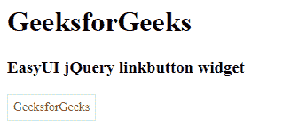

# EasyUI jQuery Link Button Widget

> 哎哎哎:# t0]https://www . geeksforgeeks . org/easy ui-jquery-link button 小部件/

EasyUI 是一个 HTML5 框架，用于使用基于 jQuery、React、Angular 和 Vue 技术的用户界面组件。它有助于构建交互式 web 和移动应用程序的功能，为开发人员节省了大量时间。

在本文中，我们将学习如何使用 jQuery EasyUI 设计链接按钮。链接按钮用于创建超链接按钮。这是一个普通的`<a>`和`<button>`标签的代表。它可以同时显示图标和文本，也可以只显示图标或文本。

**jQuery EasyUI 下载:**

```html
https://www.jeasyui.com/download/index.php
```

**语法:**

```html
<div class="linkbutton">
</div>
```

**属性:**

*   `width`: 该部件的宽度。
*   `height`: 该构件的高度。
*   `id`: 该组件的 id 属性。
*   `disabled`: 为真禁用按钮。
*   `toggle`: 为真，用户可以将其状态切换为选中或未选中。
*   `selected`: 定义按钮的状态是否被选中。
*   `group`: 表示按钮所属的组名。
*   `plain`: True 显示素色效果。
*   `text`: 按钮文本。
*   `iconCls`: 一个 CSS 类，在左侧显示一个 16×16 的图标。
*   `iconAlign`: 按钮图标的位置。
*   `size`: 按钮尺寸。

**事件:**

*   `onClick`: 点击按钮时触发。

**方法:**

*   `options`: 返回选项属性。
*   `resize`: 调整按钮大小。
*   `disable`: 禁用按钮。
*   `enable`: 启用按钮。
*   `select`: 选择按钮。
*   `unselect`: 取消选择按钮。

**CDN 链接:** 首先，添加项目所需的 jQuery EasyUI 脚本。

```html
<!-- jQuery library for EasyUI -->
<script type="text/javascript" src="jquery.easyui.min.js"></script>
<!-- jQuery library for EasyUI Mobile -->
<script type="text/javascript" src="jquery.easyui.mobile.js"></script>
```

**示例:**

```html
<!doctype html>
<html>

<head>
    <meta charset="UTF-8">
    <meta name="viewport" content="initial-scale=1.0,
            maximum-scale=1.0, user-scalable=no">

    <!-- EasyUI specific stylesheets-->
    <link rel="stylesheet" type="text/css"
        href="themes/metro/easyui.css">
    <link rel="stylesheet" type="text/css"
        href="themes/mobile.css">
    <link rel="stylesheet" type="text/css"
        href="themes/icon.css">

    <!--jQuery library -->
    <script type="text/javascript" src="jquery.min.js">
    </script>

    <!--jQuery libraries of EasyUI -->
    <script type="text/javascript"
        src="jquery.easyui.min.js">
    </script>

    <!--jQuery library of EasyUI Mobile -->
    <script type="text/javascript"
        src="jquery.easyui.mobile.js">
    </script>

    <script type="text/javascript">
        $(document).ready(function() {
            $('#gfg').linkbutton({
                text: "GeeksforGeeks"
            });
        });
    </script>
</head>

<body>

    <h1>GeeksforGeeks</h1>
    <h3>EasyUI jQuery linkbutton widget</h3>
    <a href="https://www.geeksforgeeks.org/" id="gfg" class="easyui-linkbutton">
    </a>
</body>

</html>
```

**输出:**



**参考:** `http://www.jeasyui.com/documentation/`