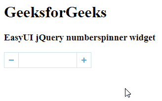

# EasyUI jQuery NumberSpinner Widget

> 原文：[https://www.geeksforgeeks.org/easyui-jquery-numberspinner-widget/](https://www.geeksforgeeks.org/easyui-jquery-numberspinner-widget/)

`EasyUI` 是一个 `HTML5` 框架，用于使用基于 `jQuery`、`React`、`Angular` 和 `Vue` 技术的用户界面组件。它有助于构建交互式 `web` 和移动应用程序的功能，为开发人员节省了大量时间。

在本文中，我们将学习如何使用 `jQuery EasyUI` 设计一个数字微调器。`numberspinner` 小部件结合了一个可编辑的文本框和两个小按钮，用户可以从一系列数值中进行选择。

## jQuery EasyUI 下载

```html
https://www.jeasyui.com/download/index.php
```

## 语法

```html
<input class="easyui-numberspinner">
```

## 属性

*   `width`：该部件的宽度。
*   `height`：这个部件的高度。
*   `value`：初始化值。
*   `min`：最小允许值。
*   `max`：最大允许值。
*   `increment`：点击微调按钮时的增量值。
*   `editable`：定义用户是否可以直接在字段中输入值。
*   `disabled`：定义是否禁用该字段。
*   `readonly`：定义组件是否只读。
*   `spinAlign`：定义旋转按钮的对齐方式。

## 方法

*   `options`：返回选项对象。
*   `setValue`：设置数字微调器值。

## 事件

*   `spinUp`：当用户单击向上微调按钮时触发。
*   `spinDown`：当用户点击向下微调按钮时触发。

## CDN 链接

首先，添加项目所需的 `jQuery EasyUI` 脚本。

```html
<!-- jQuery library for EasyUI -->
<script type="text/javascript" src="jquery.easyui.min.js">
</script>
<!-- jQuery library for EasyUI Mobile -->
<script type="text/javascript" src="jquery.easyui.mobile.js">
</script>
```

## 示例

```html
<!doctype html>
<html>

<head>
    <meta charset="UTF-8">
    <meta name="viewport"
          content="initial-scale=1.0,
                   maximum-scale=1.0, user-scalable=no">

    <!-- EasyUI specific stylesheets-->
    <link rel="stylesheet" type="text/css"
          href="themes/metro/easyui.css">

    <link rel="stylesheet" type="text/css"
          href="themes/mobile.css">

    <link rel="stylesheet" type="text/css"
          href="themes/icon.css">

    <!-- jQuery library -->
    <script type="text/javascript" src="jquery.min.js">
    </script>

    <!-- jQuery libraries of EasyUI -->
    <script type="text/javascript"
            src="jquery.easyui.min.js">
    </script>

    <!-- jQuery library of EasyUI Mobile -->
    <script type="text/javascript"
            src="jquery.easyui.mobile.js">
    </script>

    <script type="text/javascript">
        $(document).ready(function () {
            $('#gfg').numberspinner({
                min: 10,
                max: 100,
                editable: false
            });
        });
    </script>
</head>
<body>

<h1>GeeksforGeeks</h1>
<h3>EasyUI jQuery numberspinner widget</h3>
<input id="gfg" class="easyui-numberspinner">
</body>
</html>
```

## 输出



**参考：** [http://www.jeasyui.com/documentation/](http://www.jeasyui.com/documentation/)