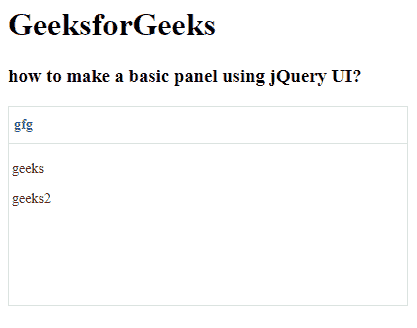

# Easy UI jQuery Panel Widget

> 哎哎哎:# t0]https://www . geeksforgeeks . org/easy ui-jquery-panel widget/

EasyUI 是一个 HTML5 框架，用于使用基于 jQuery、React、Angular 和 Vue 技术的用户界面组件。它有助于构建交互式 web 和移动应用程序的功能，为开发人员节省了大量时间。

在本文中，我们将学习如何使用 jQuery 易用户界面设计面板。面板用作其他内容物的容器。它是构建布局、选项卡、折叠等其他组件的基础组件。

## jQuery 易 UI 下载

```html
https://www.jeasyui.com/download/index.php
```

## 语法

```html
<div class="panel">
</div>
```

## 属性

*   `id`: 该面板的 id 属性。
*   `title`: 要在面板标题中显示的标题文本。
*   `iconCls`: 一个 CSS 类，在面板中显示一个 16×16 的图标。
*   `width`: 设置面板宽度。
*   `height`: 设置面板高度。
*   `left`: 设置面板左侧位置。
*   `top`: 设置面板顶部位置。
*   `cls`: 它给面板增加了一个 CSS 类。
*   `headerCls`: 它在面板标题中添加了一个 CSS 类。
*   `bodyCls`: 它给面板主体增加了一个 CSS 类。
*   `style`: 它给面板增加了自定义的规格样式。
*   `fit`: 当设置为 `true` 时，面板尺寸适合其父容器。
*   `border`: 显示面板边框。
*   `doSize`: 如果设置为 `true`，面板将被调整大小。
*   `noheader`: 如果设置为 `true`，将不会创建面板标题。
*   `content`: 设置面板主体内容。
*   `halign`: 设置面板标题对齐。
*   `titleDirection`: 设置标题标题方向。
*   `collapsible`: 如果设置，显示可折叠按钮。
*   `minimizable`: 如果设置，则显示一个可最小化按钮。
*   `maximizable`: 如果设置，则显示一个可最大化按钮。
*   `closable`: 如果设置，则显示可关闭按钮。
*   `header`: 设置面板表头。
*   `footer`: 设置面板页脚。
*   `openAnimation`: 设置开放动画。
*   `openDuration`: 设置开启时长。
*   `closeAnimation`: 设置关闭动画。
*   `closeDuration`: 设置关闭持续时间。
*   `collapsed`: 如果设置，面板在初始化时折叠。
*   `minimized`: 如果设置，面板在初始化时最小化。
*   `maximized`: 如果设置，面板在初始化时最大化。
*   `closed`: 如果设置，面板在初始化时关闭。
*   `href`: 加载远程数据然后显示在面板中的 URL。
*   `cache`: 设置为 `true`，缓存从 `href` 加载的面板内容。
*   `loadingMessage`: 加载远程数据时，在面板中显示一条消息。
*   `method`: HTTP 方法加载内容页面。
*   `queryParams`: 设置加载内容页面时发送的附加参数。
*   `loader`: 定义如何从远程服务器加载内容页面。

## 事件

*   `onBeforeLoad`: 加载内容页面前触发，返回 `false` 忽略该动作。
*   `onLoad`: 加载远程数据时触发。
*   `onLoadError`: 在加载内容页面时出现一些错误时触发。
*   `onBeforeOpen`: 在面板打开前会触发。
*   `onOpen`: 面板打开后会开火。
*   `onBeforeClose`: 它在面板关闭前触发。
*   `onClose`: 面板关闭后会触发。
*   `onBeforeDestroy`: 它在面板被破坏前开火。
*   `onDestroy`: 面板被破坏后会开火。
*   `onBeforeCollapse`: 它会在面板折叠之前触发。
*   `onCollapse`: 面板折叠后会触发。
*   `onBeforeExpand`: 它在面板展开前触发。
*   `onExpand`: 面板展开后会开火。
*   `onResize`: 面板调整大小时触发。
*   `onMove`: 面板移动后会触发。
*   `onMaximize`: 它在窗口最大化后触发。
*   `onRestore`: 在窗口恢复到原始大小后触发。
*   `onMinimize`: 它在窗口最小化后触发。

## 方法

*   `options()`: 返回选项属性。
*   `panel()`: 返回外面板对象。
*   `header()`: 返回面板表头对象。
*   `footer()`: 返回面板页脚对象。
*   `body()`: 返回面板主体对象。
*   `setTitle(title)`: 设置表头的标题文本。
*   `open(forceOpen)`: 当打开参数设置为真时。
*   `close(forceClose)`: 当强制关闭参数设置为真时，面板关闭。
*   `destroy(forceDestroy)`: 当 forceDestroy 参数设置为 true 时，面板被销毁。
*   `clear()`: 清除面板内容。
*   `refresh()`: 刷新面板加载远程数据。
*   `resize(options)`: 设置面板大小，做布局。
*   `doLayout()`: 设置面板内子组件的大小。
*   `move(options)`: 将面板移动到新位置。
*   `maximize()`: 将面板放入容器中。
*   `minimize()`: 最小化面板。
*   `restore()`: 将最大化的面板恢复到原来的大小和位置。
*   `collapse()`: 折叠面板体。
*   `expand()`: 展开面板体。

## CDN 链接

首先，添加项目所需的 jQuery Easy UI 脚本。

```html
<!-- EasyUI 的 jQuery 库 -->
<script type="text/javascript" src="jquery.easyui.min.js"></script>
<!-- EasyUI Mobile 的 jQuery 库 -->
<script type="text/javascript" src="jquery.easyui.mobile.js"></script>
```

## 示例

```html
<!doctype html> 
<html>

<head> 
    <meta charset="UTF-8"> 
    <meta name="viewport" content="initial-scale=1.0, 
        maximum-scale=1.0, user-scalable=no">

    <!-- EasyUI specific stylesheets-->
    <link rel="stylesheet" type="text/css"
        href="themes/metro/easyui.css">
    <link rel="stylesheet" type="text/css"
        href="themes/mobile.css">
    <link rel="stylesheet" type="text/css"
        href="themes/icon.css">

    <!--jQuery library -->
    <script type="text/javascript" src="jquery.min.js"> 
    </script>

    <!--jQuery libraries of EasyUI -->
    <script type="text/javascript"
        src="jquery.easyui.min.js"> 
    </script>

    <!--jQuery library of EasyUI Mobile -->
    <script type="text/javascript"
        src="jquery.easyui.mobile.js"> 
    </script>

</head>

<body>     
    <h1>GeeksforGeeks</h1>
    <h3>how to make a basic panel using jQuery UI?</h3>
    <div id="p" class="easyui-panel" title="gfg" 
         style="width:400px;height:200px;padding:3px">
        <p>geeks</p>
        <p>geeks2</p>
    </div>

</body>
</html>
```

## 输出



基本面板

**参考:** http://www.jeasyui.com/documentation/