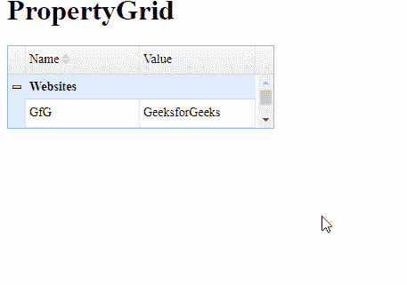

# EasyUI jQuery Property Grid Widget

> 哎哎哎:# t0]https://www . geeksforgeeks . org/easy ui-jquery-property grid widget/

EasyUI 是一个 HTML5 框架，用于使用基于 jQuery、React、Angular 和 Vue 技术的用户界面组件。它有助于构建交互式 web 和移动应用程序的功能，为开发人员节省了大量时间。

在本文中，我们将学习如何使用 jQuery Easy UI 设计一个 `propertygrid`。`propertygrid` 为用户提供了浏览和编辑对象属性的界面。

## jQuery Easy UI 下载

```html
https://www.jeasyui.com/download/index.php
```

## 语法

```html
<input class="easyui-propertygrid">
```

## 属性

*   `showGroup`: 定义是否显示属性组。
*   `groupField`: 定义组字段名称。
*   `groupFormatter`: 定义如何格式化组值。

## 方法

*   `groups()`: 返回所有组。
*   `expandGroup()`: 展开指定的组。
*   `collapseGroup()`: 折叠指定的组。

## 实现步骤

首先，添加项目所需的 jQuery Easy UI 脚本。

```html
<link rel="stylesheet" type="text/css" href="https://www.jeasyui.com/easyui/themes/default/easyui.css">
<link rel="stylesheet" type="text/css" href="https://www.jeasyui.com/easyui/themes/icon.css">
<script type="text/javascript" src="https://www.jeasyui.com/easyui/jquery.min.js"></script>
<script type="text/javascript" src="https://www.jeasyui.com/easyui/jquery.easyui.min.js"></script>
```

## 示例

### HTML 代码

```html
<html>
<head>    
    <link rel="stylesheet" type="text/css" 
        href="https://www.jeasyui.com/easyui/themes/default/easyui.css">

<link rel="stylesheet" type="text/css" 
        href="https://www.jeasyui.com/easyui/themes/icon.css">

<script type="text/javascript" 
        src="https://www.jeasyui.com/easyui/jquery.min.js"></script>

<script type="text/javascript" 
        src="https://www.jeasyui.com/easyui/jquery.easyui.min.js"></script>
</head>

<body>
    <h1>PropertyGrid</h1>
    <table id="gfg" style="width:300px"></table>

<script type="text/javascript">
        $('#gfg').propertygrid({
            showGroup: true,
            scrollbarSize: 20
        });
        var row = {
          name:'GfG',
          value:'GeeksforGeeks',
          group:'Websites',
          editor:'text'
        };
        $('#gfg').propertygrid('appendRow',row);
        var row = {
          name:'GfG',
          value:'Self Placed',
          group:'Courses',
          editor:'text'
        };
        $('#gfg').propertygrid('appendRow',row);
    </script>
</body>

</html>
```

## 输出



## 参考

http://www.jeasyui.com/documentation/