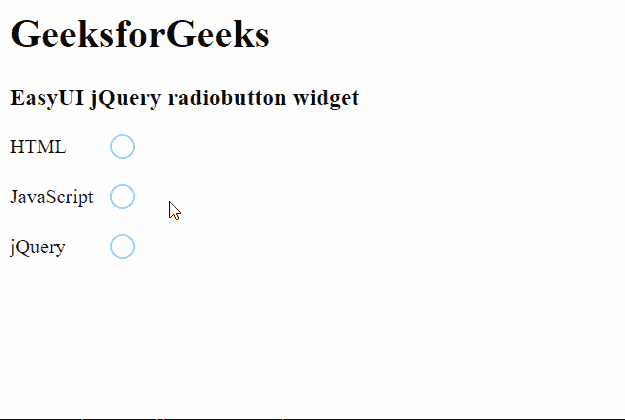

# Easy UI jQuery Radio Button Widget

> 哎哎哎:# t0]https://www . geeksforgeeks . org/easy ui-jquery-radio button widget/

EasyUI 是一个 HTML5 框架，用于使用基于 jQuery、React、Angular 和 Vue 技术的用户界面组件。它有助于构建交互式 web 和移动应用程序的功能，为开发人员节省了大量时间。

在本文中，我们将学习如何使用 jQuery EasyUI 设计一个 Radiobutton。单选按钮小部件用于制作单选按钮，该按钮可用于选择所需的选项。一个组中只能选择一个选项。

## jQuery 易 UI 下载

```html
https://www.jeasyui.com/download/index.php
```

## 语法

```html
<input class="easyui-radiobutton">
```

## 属性

*   `width`: 是要制作的 Radiobutton 组件的宽度。
*   `height`: 是要制作的 Radiobutton 组件的高度。
*   `value`: 是绑定到要制作的单选按钮的默认值。
*   `checked`: 定义是否选中单选按钮。
*   `disabled`: 定义是否要禁用单选按钮。
*   `label`: 是绑定到要制作的 Radiobutton 上的标签。
*   `labelWidth`: 是标签宽度。
*   `labelPosition`: 是标签位置。可能的值是“之前”、“之后”和“顶部”。
*   `labelAlign`: 是标签对齐。可能的值是“左”和“右”。

## 事件

*   `onChange`: 当值改变时，它会触发。

## 方法

*   `options()`: 返回选项对象。
*   `setValue()`: 设置单选按钮的值。
*   `disable()`: 禁用组件。
*   `enable()`: 使能组件。
*   `check()`: 检查部件。
*   `uncheck()`: 取消勾选组件。
*   `clear()`: 清除“已检查”值。
*   `reset()`: 重置“已检查”值。

### CDN 链接

首先，添加项目所需的 jQuery Easy UI 脚本。

> <!--易 UI 的 jQuery 库-->
> <script type="text/javascript" src="jquery.easyui.min.js"></script>
> <!--易 UI Mobile 的 jQuery 库-->
> <script type="text/javascript" src="jquery.easyui.mobile.js"></script>

## 示例

### 超文本标记语言

```html
<html>
<head>

<!-- EasyUI specific stylesheets-->
  <link rel="stylesheet" 
        type="text/css" 
        href="themes/metro/easyui.css">

<link rel="stylesheet"
        type="text/css"
        href="themes/mobile.css">

<link rel="stylesheet"
        type="text/css"
        href="themes/icon.css">

<!--jQuery library -->
  <script type="text/javascript"
          src="jquery.min.js">
  </script>

<!--jQuery libraries of EasyUI -->
  <script type="text/javascript"
          src="jquery.easyui.min.js">
  </script>

<!--jQuery library of EasyUI Mobile -->
  <script type="text/javascript"
          src="jquery.easyui.mobile.js">
  </script>
</head>
<body>
  <h1>GeeksforGeeks</h1>
  <h3>EasyUI jQuery radiobutton widget</h3>

<form id="gfg">
    <div style="margin-bottom:20px">
      <input class="easyui-radiobutton" 
             name="language" 
             value="HTML" 
             label="HTML">
    </div>
    <div style="margin-bottom:20px">
      <input class="easyui-radiobutton" 
             name="language"
             value="JavaScript"
             label="JavaScript">
    </div>
    <div style="margin-bottom:20px">
      <input class="easyui-radiobutton" 
             name="language"
             value="jQuery"
             label="jQuery">
    </div>
  </form>
</body>
</html>
```

### 输出



**参考:** https://www.jeasyui.com/documentation/radiobutton.php