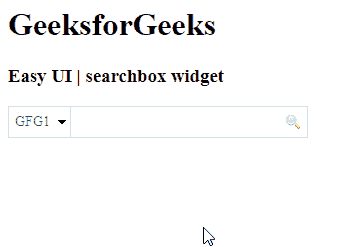

# EasyUI jQuery 搜索框小部件

> 哎哎哎:# t0]https://www . geeksforgeeks . org/easy ui-jquery-searchbox 小部件/

在本文中，我们将学习如何使用 jQuery EasyUI 搜索框小部件设计一个搜索框小部件，该部件允许用户通过搜索值来搜索数据。EasyUI 是一个 HTML5 框架，用于使用基于 jQuery、React、Angular 和 Vue 技术的用户界面组件。它有助于构建交互式 web 和移动应用程序的功能，为开发人员节省了大量时间。

**下载 jQuery 的 EasyUI:**

```html
https://www.jeasyui.com/download/index.php
```

**语法:**

```javascript
var a = $(".selector").searchbox({
});
```

**属性:**

*   `height`: 构件的高度。
*   `width`: 构件的宽度。
*   `prompt`: 输入框中显示的提示信息。
*   `value`: 需要输入的值。
*   `menu`: 搜索类型菜单。
*   `searcher`: 当用户按下搜索按钮或按下回车键时，将调用 `searcher` 功能。
*   `disabled`: 该属性用于禁用组件。

**方法:**

*   `reset`: 复位数值。
*   `clear`: 清零值。
*   `enable`: 启用搜索框。
*   `destroy`: 销毁搜索框。
*   `disable`: 禁用搜索框。
*   `resize`: 调整搜索框的大小。
*   `selectName`: 选择当前搜索类型名称。
*   `getValue`: 它返回当前搜索类型名称。
*   `setValue`: 设置当前搜索类型名称。
*   `textbox`: 返回文本框对象。
*   `menu`: 它返回搜索类型菜单对象。
*   `options`: 返回选项对象。

**CDN 链接:**
首先，添加项目所需的 jQuery EasyUI 脚本。

```html
<!-- jQuery library for EasyUI -->
<script type="text/javascript" src="jquery.easyui.min.js"></script>
<!-- jQuery library for EasyUI Mobile -->
<script type="text/javascript" src="jquery.easyui.mobile.js"></script>
```

**示例:**

## HTML

```html
<!doctype html> 
<html>

<head> 
    <meta charset="UTF-8"> 
    <meta name="viewport" 
          content="initial-scale=1.0, maximum-scale=1.0, 
                   user-scalable=no">

    <!-- EasyUI specific stylesheets-->
    <link rel="stylesheet" type="text/css"
          href="themes/metro/easyui.css">
    <link rel="stylesheet" type="text/css"
          href="themes/mobile.css">
    <link rel="stylesheet" type="text/css"
          href="themes/icon.css">

    <!-- jQuery library -->
    <script type="text/javascript" 
            src="jquery.min.js"> 
    </script>

    <!-- jQuery libraries of EasyUI -->
    <script type="text/javascript"
        src="jquery.easyui.min.js"> 
    </script>

    <!-- jQuery library of EasyUI Mobile -->
    <script type="text/javascript"
        src="jquery.easyui.mobile.js"> 
    </script> 
</head>

<body> 
    <h1>GeeksforGeeks</h1>
    <h3>EasyUI | searchbox widget</h3>
    <input id="ss" class="easyui-searchbox" 
           style="width:300px" data-options="menu:'#men'">
    <div id="men" style="width:120px">
       <div>GFG1</div>
       <div>GFG2</div>
    </div>
</body>
</html>
```

**输出:**



**参考:**
http://www.jeasyui.com/documentation/