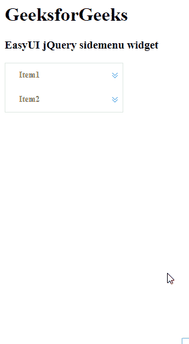

# Easy UI jQuery Side Menu Widget

> 哎哎哎:# t0]https://www . geeksforgeeks . org/easy ui-jquery-side menu widget/

EasyUI 是一个 HTML5 框架，用于使用基于 jQuery、React、Angular 和 Vue 技术的用户界面组件。它有助于构建交互式 web 和移动应用程序的功能，为开发人员节省了大量时间。

在本文中，我们将学习如何使用 jQuery EasyUI 设计侧菜单。侧菜单用于上下文垂直菜单。它是构建另一个菜单组件的基础组件。它还可以用于导航和执行命令。

**jQuery 易 UI 下载:**

```html
https://www.jeasyui.com/download/index.php
```

**语法:**

```html
<div class="sidemenu">
</div>
```

**属性:**

*   `width`: 侧菜单组件的宽度。
*   `height`: 侧菜单组件的高度。
*   `border`: 定义显示边框。
*   `animate`: 定义在展开或折叠菜单时是否显示动画效果。
*   `multiple`: 设置为`true`可以一次展开多个面板。
*   `data`: 要显示的菜单数据。
*   `floatMenuWidth`: 浮动菜单宽度。
*   `floatMenuPosition`: 浮动菜单位置。

**事件:**

*   `onSelect`: 启动选择菜单时。

**方法:**

*   `options`: 返回侧菜单的选项。
*   `resize`: 调整侧菜单的大小。
*   `collapse`: 折叠侧菜单。
*   `expand`: 展开侧菜单。
*   `destroy`: 破坏侧菜单。

**CDN 链接:** 首先，添加项目所需的 jQuery Easy UI 脚本。

```html
<!-- jQuery library for EasyUI -->
<script type="text/javascript" src="jquery.easyui.min.js"></script>
<!-- jQuery library for EasyUI Mobile -->
<script type="text/javascript" src="jquery.easyui.mobile.js"></script>
```

**示例:**

## HTML

```html
<!doctype html>
<html>
    <head>
        <meta charset="UTF-8">
        <meta name="viewport" content="initial-scale=1.0,
            maximum-scale=1.0, user-scalable=no">

        <!-- EasyUI specific stylesheets-->
        <link rel="stylesheet" type="text/css"
            href="themes/metro/easyui.css">
        <link rel="stylesheet" type="text/css"
            href="themes/mobile.css">
        <link rel="stylesheet" type="text/css"
            href="themes/icon.css">

        <!-- jQuery library -->
        <script type="text/javascript" src="jquery.min.js">
        </script>

        <!-- jQuery libraries of EasyUI -->
        <script type="text/javascript"
            src="jquery.easyui.min.js">
        </script>

        <!-- jQuery library of EasyUI Mobile -->
        <script type="text/javascript"
            src="jquery.easyui.mobile.js">
        </script>

        <script type="text/javascript">
            $(document).ready(function (){
                $('#gfg').sidemenu({
                    text: "GeeksforGeeks"
                });
            });
        </script>
    </head>

    <body>
        <h1>GeeksforGeeks</h1>
        <h3>EasyUI jQuery sidemenu widget</h3>
        <div id="gfg" class="easyui-sidemenu"
             data-options="data:data">
        </div>
        <script type="text/javascript">
            var data = [{
                text: 'Item1',
                children: [{
                    text: 'Geeks1'
                },{
                    text: 'Geeks2'
                },{
                    text: 'Geeks3',
                    children: [{
                        text: 'For3.1'
                    },{
                        text: 'For3.2'
                    }]
                }]
            },{
                text: 'Item2',
                children: [{
                    text: 'Geeks4'
                },{
                    text: 'Geeks5'
                },{
                    text: 'Geeks6'
                }]
            }];
        </script>
    </body>
</html>
```

**输出:**



**参考:** http://www.jeasyui.com/documentation/