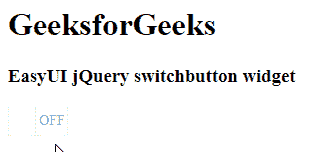

# Easy UI jQuery Switch Buttons Widget

> 哎哎哎::1230【https://www . geeksforgeeks . org/easy ui-jquery-switch buttons 小部件/

EasyUI 是一个 HTML5 框架，用于使用基于 jQuery、React、Angular 和 Vue 技术的用户界面组件。它有助于构建交互式 web 和移动应用程序的功能，为开发人员节省了大量时间。

在本文中，我们将学习如何使用 jQuery 易用户界面设计 `switchbutton`。`Switchbutton` 有两个部分:“开”和“关”。用户可以点击或轻按来切换开关。

## jQuery 易 UI 下载

```html
https://www.jeasyui.com/download/index.php
```

## 语法

```html
<div class="switchbutton">
</div>
```

## 属性

*   `width`: 开关按钮的宽度
*   `height`: 开关按钮的高度
*   `handleWidth`: 开关按钮中央手柄的宽度
*   `checked`: 定义按钮是否被选中
*   `disabled`: 定义是否禁用按钮
*   `readonly`: 定义按钮是否只读
*   `reversed`: 设置为真，文本值和非文本值将切换它们的位置
*   `onText`: 左侧的文本值。
*   `offText`: 右侧的文本值
*   `handleText`: 中心手柄的文本值。
*   `value`: 绑定到按钮的默认值。

## 事件

*   `onChange`: 当检查值改变时触发

## 方法

*   `options`: 返回选项对象
*   `resize`: 调整开关按钮的大小
*   `disable`: 禁用开关按钮
*   `enable`: 启用开关按钮
*   `readonly`: 启用/禁用只读模式
*   `check`: 检查开关按钮
*   `uncheck`: 取消选中开关按钮
*   `clear`: 清除开关按钮的“已检查”值
*   `reset`: 重置开关按钮的“已检查”值
*   `setValue`: 设置开关按钮值

## CDN 链接

首先，添加项目所需的 jQuery Easy UI 脚本。

## 例 1

```html
<!doctype html>
<html>

<head>
    <meta charset="UTF-8">
    <meta name="viewport" content="initial-scale=1.0,
        maximum-scale=1.0, user-scalable=no">

    <!-- EasyUI specific stylesheets-->
    <link rel="stylesheet" type="text/css"
        href="themes/metro/easyui.css">

    <link rel="stylesheet" type="text/css"
        href="themes/mobile.css">

    <link rel="stylesheet" type="text/css"
        href="themes/icon.css">

    <!--jQuery library -->
    <script type="text/javascript" src="jquery.min.js">
    </script>

    <!--jQuery libraries of EasyUI -->
    <script type="text/javascript"
        src="jquery.easyui.min.js">
    </script>

    <!--jQuery library of EasyUI Mobile -->
    <script type="text/javascript"
        src="jquery.easyui.mobile.js">
    </script>

    <script type="text/javascript">
      $(document).ready(function (){
        $('#gfg').switchbutton({
          disabled: true
        });
      });
    </script>
</head>

<body>

    <h1>GeeksforGeeks</h1>
    <h3>EasyUI jQuery switchbutton widget</h3>
    <input id="gfg" class="easyui-switchbutton">

</body>
</html>
```

## 输出



## 参考

[http://www.jeasyui.com/documentation/](http://www.jeasyui.com/documentation/)