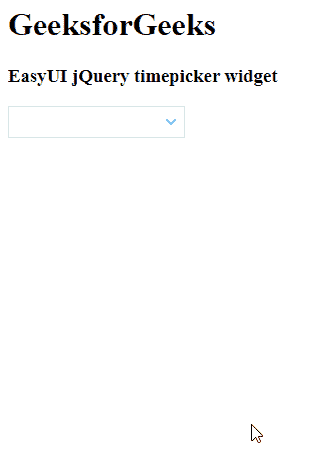

# EasyUI jQuery TimePicker Widget

> 哎哎哎:# t0]https://www . geeksforgeeks . org/easy ui-jquery-time picker 小部件/

EasyUI 是一个 HTML5 框架，用于使用基于 jQuery、React、Angular 和 Vue 技术的用户界面组件。它有助于构建交互式 web 和移动应用程序的功能，为开发人员节省了大量时间。

在本文中，我们将学习如何使用 jQuery EasyUI 设计一个时间选择器。时间选择器小部件用于显示选择器，该选择器可用于以所需格式选择时间。

## jQuery EasyUI 下载

```html
https://www.jeasyui.com/download/index.php
```

## 语法

```html
<input class="easyui-timepicker">
```

## 属性

*   `closeText`: 关闭按钮显示的文本。
*   `okText`: 确定按钮显示的文本。
*   `value`: 是拣货机的默认时间。
*   `ampm`: 这些是 AM 和 pm 按钮的标签。
*   `hour24`: 定义是否以 24 小时格式显示时间。

## 方法

*   `options()`: 返回选项对象。
*   `getValue()`: 获取组件值。
*   `setValue()`: 设置组件值。
*   `reset()`: 复位元件值。

## CDN 链接

首先，添加项目所需的 jQuery Easy UI 脚本。

```html
<!-- EasyUI 的 jQuery 库 -->
<script type="text/javascript" src="jquery.easyui.min.js"></script>
<!-- EasyUI Mobile 的 jQuery 库 -->
<script type="text/javascript" src="jquery.easyui.mobile.js"></script>
```

## 示例 1

```html
<html>
<head>

<!-- EasyUI specific stylesheets-->
  <link rel="stylesheet" 
        type="text/css" 
        href="themes/metro/easyui.css">

<link rel="stylesheet"
        type="text/css" 
        href="themes/mobile.css">

<link rel="stylesheet"
        type="text/css"
        href="themes/icon.css">

<!-- jQuery library -->
  <script type="text/javascript" 
          src="jquery.min.js">
  </script>

<!-- jQuery libraries of EasyUI -->
  <script type="text/javascript"
          src="jquery.easyui.min.js">
  </script>

<!-- jQuery library of EasyUI Mobile -->
  <script type="text/javascript" 
          src="jquery.easyui.mobile.js">
  </script>

<script type="text/javascript">
    $('#gfg').timepicker({
      hour24: false
    })
  </script>
</head>

<body>

<h1>GeeksforGeeks</h1>
  <h3>EasyUI jQuery timepicker widget</h3>

<!-- Define the EasyUI TimePicker 
  with markup -->
  <input id="gfg" class="easyui-timepicker">
</body>
</html>
```

**输出:**



## 示例 2

```html
<html>
<head>

<!-- EasyUI specific stylesheets-->
  <link rel="stylesheet" 
        type="text/css" 
        href="themes/metro/easyui.css">

<link rel="stylesheet" 
        type="text/css" 
        href="themes/mobile.css">

<link rel="stylesheet" 
        type="text/css"
        href="themes/icon.css">

<!-- jQuery library -->
  <script type="text/javascript"
          src="jquery.min.js">
  </script>

<!--jQuery libraries of EasyUI -->
  <script type="text/javascript" 
          src="jquery.easyui.min.js">
  </script>

<!--jQuery library of EasyUI Mobile -->
  <script type="text/javascript"
          src="jquery.easyui.mobile.js">
  </script>
</head>
<body>
  <h1>GeeksforGeeks</h1>
  <h3>EasyUI jQuery timepicker widget</h3>

<!-- Define the element that 
  will be used as the TimePicker -->
  <input id='gfg'>

<script type="text/javascript">

// Initialize the EasyUI TimePicker
    $('#gfg').timepicker({
      hour24: false
    });
  </script>
</body>
</html>
```

**输出:**


**参考:** https://www.jeasyui.com/documentation/timepicker.php