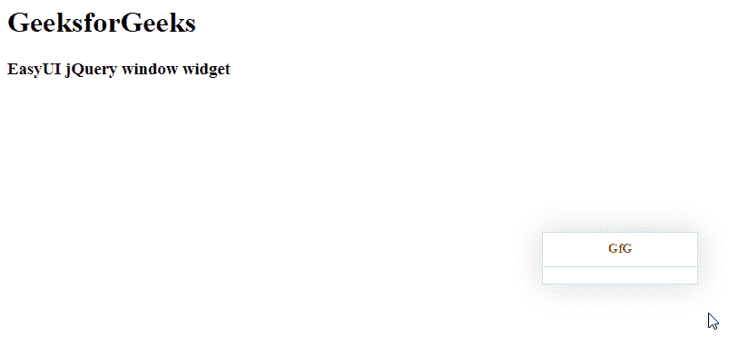

# EasyUI jQuery 窗口小部件

> 哎哎哎:# t0]https://www . geeksforgeeks . org/easy ui-jquery-window widget/

在本文中，我们将学习如何使用 jQuery EasyUI 设计一个窗口。`窗口`小部件是可拖动面板，可用作应用程序窗口。它浮动在页面上，可以移动到任何需要的地方。 EasyUI 是一个 HTML5 框架，用于使用基于 jQuery、React、Angular 和 Vue 技术的用户界面组件。它有助于构建交互式 web 和移动应用程序的功能，为开发人员节省了大量时间。

## jQuery EasyUI 下载

```html
https://www.jeasyui.com/download/index.php
```

## 语法

```html
<input class="easyui-window">
```

## 属性

*   `title`: 是窗口的标题文本。
*   `collapsible`: 定义是否显示可折叠按钮。
*   `minimizable`: 定义是否显示可最小化按钮。
*   `maximizable`: 定义是否显示最大化按钮。
*   `closable`: 定义是否显示可关闭按钮。
*   `closed`: 定义窗户是否关闭。
*   `zIndex`: 是窗口的 z-index。
*   `draggable`: 定义窗口是否可以拖动。
*   `resizable`: 定义窗口是否可以调整大小。
*   `shadow`: 它定义了窗户的阴影。如果设置为 true，将显示阴影。
*   `inline`: 它定义了如何使窗口停留在其父窗口内。
*   `modal`: 定义窗口是否为模态窗口。
*   `border`: 定义窗口边框样式。
*   `constrain`: 定义是否约束窗口位置。

## 方法

*   `window`: 返回外窗对象。
*   `hcenter`: 它使窗户水平居中。
*   `vcenter`: 它将窗口垂直居中。
*   `center`: 它将窗口居中显示在屏幕上。

## CDN 链接

首先，添加项目所需的 jQuery EasyUI 脚本。

```html
<!-- jQuery 的 EasyUI 库 -->
<script type="text/javascript" src="jquery.easyui.min.js"></script>
<!-- jQuery 的 EasyUI Mobile 库 -->
<script type="text/javascript" src="jquery.easyui.mobile.js"></script>
```

## 示例

```html
<html>
<head>
    <!-- EasyUI 特定样式表 -->
    <link rel="stylesheet" type="text/css" href="themes/metro/easyui.css">
    <link rel="stylesheet" type="text/css" href="themes/mobile.css">
    <link rel="stylesheet" type="text/css" href="themes/icon.css">

    <!-- jQuery 库 -->
    <script type="text/javascript" src="jquery.min.js"></script>

    <!-- EasyUI 的 jQuery 库 -->
    <script type="text/javascript" src="jquery.easyui.min.js"></script>

    <!-- EasyUI Mobile 的 jQuery 库 -->
    <script type="text/javascript" src="jquery.easyui.mobile.js"></script>

    <script type="text/javascript">
        $(document).ready(function (){
            $('#gfg').window({
                title: 'GfG',
                resizable: true
            });
        });
    </script>
</head>
<body>
    <h1>GeeksforGeeks</h1>
    <h3>EasyUI jQuery window widget</h3>

    <!-- 创建 EasyUI 窗口 -->
    <input id="gfg" class="easyui-window">
</body>
</html>
```

## 输出



## 参考

https://www.jeasyui.com/documentation/window.php