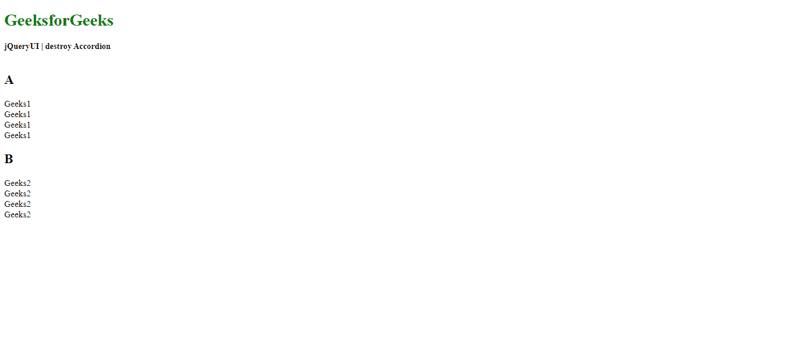

# jQuery UI 手风琴 `destroy()` 方法

> 原文：[https://www.geeksforgeeks.org/jquery-ui-accordion-destroy-method/](https://www.geeksforgeeks.org/jquery-ui-accordion-destroy-method/)

要在 jQuery UI 中销毁手风琴，我们将使用 `destroy()` 方法，这将在下面讨论：

jQuery UI `destroy()` 方法用于移除手风琴的完整功能。它将手风琴式元素完全恢复到初始状态。

## 语法：

```html
$( ".selector" ).accordion( "destroy" )
```

## 参数：
此方法不接受任何参数。

## 返回值：
这个方法只是将手风琴返回到初始状态。

## 方法：
首先，添加项目所需的 jQuery 和 jQuery UI 脚本。

```html
<script src="https://ajax.googleapis.com/ajax/libs/jquery/1.7.1/jquery.js"></script>
<script src="https://ajax.googleapis.com/ajax/libs/jqueryui/1.8.16/jquery-ui.js"></script>
<link href="http://ajax.googleapis.com/ajax/libs/jqueryui/1.8.16/themes/ui-lightness/jquery-ui.css" rel="stylesheet" type="text/css" />
```

## 示例：

```html
<!DOCTYPE html>
<html>
<head>
    <meta charset="utf-8">
    <meta name="viewport" content="width=device-width, initial-scale=1">
    <script src="https://ajax.googleapis.com/ajax/libs/jquery/1.7.1/jquery.js"></script>
    <script src="https://ajax.googleapis.com/ajax/libs/jqueryui/1.8.16/jquery-ui.js"></script>
    <link href="http://ajax.googleapis.com/ajax/libs/jqueryui/1.8.16/themes/ui-lightness/jquery-ui.css" rel="stylesheet" type="text/css" />
    <style>
        .height {
            height: 10px;
        }
        #gfg {
            font-size: 17px;
        }
    </style>
    <script>
        $(function () {
            $( "#gfg" ).accordion();
            $( "#gfg" ).accordion( "destroy" );
        });
    </script>
</head>
<body>
    <h1 style="color:green">GeeksforGeeks</h1>
    <b>jQuery UI | destroy Accordion</b>
    <br>
    <br>
    <div id="gfg">
        <h2>A</h2>
        <div>Geeks1
            <br>Geeks1
            <br>Geeks1
            <br>Geeks1
            <br>
        </div>
        <h2>B</h2>
        <div>Geeks2
            <br>Geeks2
            <br>Geeks2
            <br>Geeks2
        </div>
    </div>
</body>
</html>
```

## 输出：

