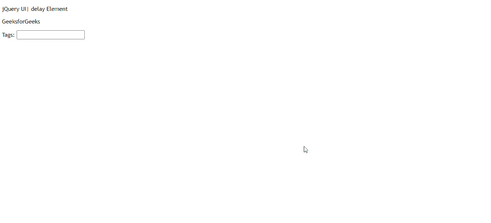
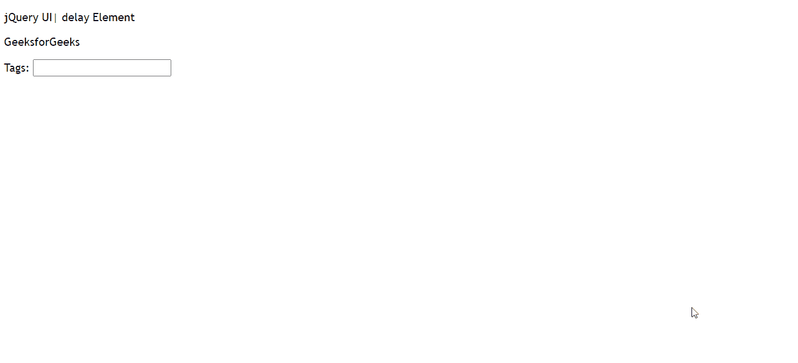

# jQuery UI 自动完成延迟选项

> 原文：[https://www.geeksforgeeks.org/jquery-ui-autocomplete-delay-option/](https://www.geeksforgeeks.org/jquery-ui-autocomplete-delay-option/)

jQuery UI 自动完成`delay`选项用于设置建议显示给用户的时间。默认值为`300`。

**语法：**

```javascript
$( ".selector" ).autocomplete({delay: 300})
```

**方法：** 首先，添加项目所需的 jQuery Mobile 脚本。

> <script src="https://ajax.googleapis.com/ajax/libs/jqueryui/1.8.16/jquery-ui.js"></script><link href="http://ajax.googleapis.com/ajax/libs/jqueryui/1.8.16/themes/ui-lightness/jquery-ui.css" rel="stylesheet" type="text/css" />

### 示例 1

```html
<!DOCTYPE html> 
<html>

<head> 
    <meta charset="utf-8"> 
    <meta name="viewport" content= 
        "width=device-width, initial-scale=1">

<script src= 
"https://ajax.googleapis.com/ajax/libs/jquery/1.7.1/jquery.js"> 
    </script>

<script src= 
"https://ajax.googleapis.com/ajax/libs/jqueryui/1.8.16/jquery-ui.js"> 
    </script>

<link href= 
"http://ajax.googleapis.com/ajax/libs/jqueryui/1.8.16/themes/ui-lightness/jquery-ui.css"
        rel="stylesheet" type="text/css" />

<style> 
        .height { 
            height: 10px; 
        } 
    </style>

<script>
         $(function() {
            var list  =  [
               "One",
               "two",
               "Three",
               "Four",
            ];
            $( "#gfg" ).autocomplete({
               source: list,
               delay:300
            });
         });
      </script>
   </head>

<body>
      <div class = "ui-widget"> 
        <p>jQuery UI| delay Element</p>
        <p>GeeksforGeeks</p>
        <label for = "gfg">Tags: </label>
        <input id = "gfg">
      </div>
   </body>
</html>
```

**输出：**



### 示例 2

```html
<!DOCTYPE html> 
<html>

<head> 
    <meta charset="utf-8"> 
    <meta name="viewport" content= 
        "width=device-width, initial-scale=1">

<script src= 
"https://ajax.googleapis.com/ajax/libs/jquery/1.7.1/jquery.js"> 
    </script>

<script src= 
"https://ajax.googleapis.com/ajax/libs/jqueryui/1.8.16/jquery-ui.js"> 
    </script>

<link href= 
"http://ajax.googleapis.com/ajax/libs/jqueryui/1.8.16/themes/ui-lightness/jquery-ui.css"
        rel="stylesheet" type="text/css" />

<style> 
        .height { 
            height: 10px; 
        } 
    </style>

<script>
         $(function() {
            var list  =  [
               "One",
               "two",
               "Three",
               "Four",
            ];
            $( "#gfg" ).autocomplete({
               source: list,
               delay:700
            });
         });
      </script>
   </head>

<body>
      <div class = "ui-widget">
        <p>jQuery UI| delay Element</p>
        <p>GeeksforGeeks</p>
        <label for = "gfg">Tags: </label>
        <input id = "gfg">
      </div>
   </body>
</html>
```

**输出：**

