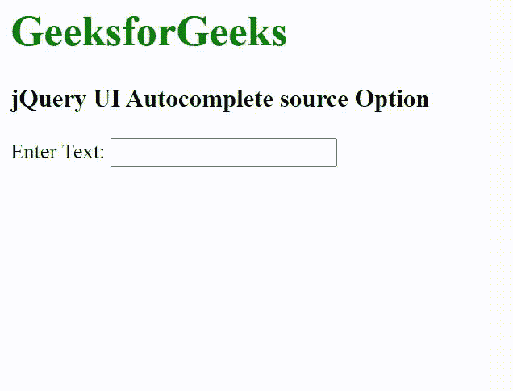

# jQuery UI 自动完成源码选项

> 原文：[https://www.geeksforgeeks.org/jquery-ui-autocomplete-source-option/](https://www.geeksforgeks.org/jquery-ui-autocomplete-source-option/)

jQuery UI 由 GUI 小部件、视觉效果和使用 jQuery、CSS 和 HTML 实现的主题组成。jQuery 用户界面非常适合为网页构建用户界面。jQuery UI 自动完成源选项用于添加建议菜单中使用的数据源。

## 语法

```html
$( ".selector" ).autocomplete({
  source: [ "GFG", "Geeks", "G4G" ]
});
```

## CDN 链接

首先，添加项目所需的 jQuery UI 脚本。

```html
<link rel="stylesheet" href="//code.jquery.com/ui/1.12.1/themes/smoothness/jquery-ui.css">
<script src="//code.jquery.com/jquery-1.12.4.js"></script>
<script src="//code.jquery.com/ui/1.12.1/jquery-ui.js"></script>
```

## 示例

### HTML

```html
<!DOCTYPE html>
<html lang="en">

<head>
    <meta charset="utf-8">
    <link rel="stylesheet" href="//code.jquery.com/ui/1.12.1/themes/base/jquery-ui.css">
    <script src="https://code.jquery.com/jquery-1.12.4.js"></script>
    <script src="https://code.jquery.com/ui/1.12.1/jquery-ui.js"></script>
    <script>
        $(function () {
            var list = [
                "One",
                "two",
                "Three",
                "Four",
            ];
            $("#gfg").autocomplete({
                source: list
            });
        });
    </script>
</head>

<body>
    <h1 style="color: green;">GeeksforGeeks</h1>
    <h3>jQuery UI Autocomplete source Option</h3>
    <label for="gfg">Enter Text:</label>
    <input id="gfg">
</body>

</html>
```

## 输出



## 参考

[https://api.jqueryui.com/autocomplete/#option-source](https://api.jqueryui.com/autocomplete/#option-source)