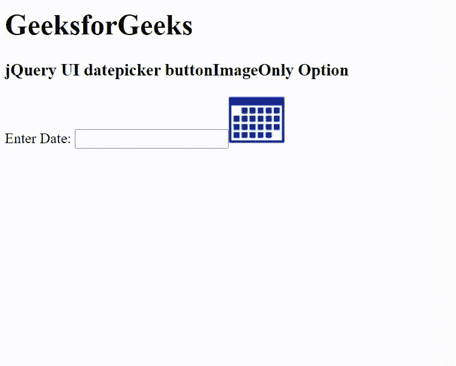

# jQuery UI datepicker buttonImageOnly Option

> 哎哎哎:# t0]https://www . geeksforgeeks . org/jquery-ui-date picker-button imageonly 选项/

jQuery UI 由 GUI 小部件、视觉效果和使用 jQuery 实现的主题组成。jQuery 用户界面非常适合为网页构建用户界面。jQuery UI datepicker 的 `buttonImageOnly` 选项用于检查按钮图像是否应该由它自己呈现，而不是在按钮元素内部呈现。

## 语法

```html
$( ".selector" ).datepicker({
  buttonImageOnly: true/false
});
```

## CDN 链接

首先，添加项目所需的 jQuery UI 脚本。

```html
<link rel="stylesheet" href="//code.jquery.com/ui/1.12.1/themes/smoothness/jquery-ui.css">
<script src="//code.jquery.com/jquery-1.12.4.js"></script>
<script src="//code.jquery.com/ui/1.12.1/jquery-ui.js"></script>
```

## 示例

### HTML

```html
<!DOCTYPE html>
<html lang="en">

<head>
    <meta charset="utf-8" />
    <link href="https://code.jquery.com/ui/1.10.4/themes/ui-lightness/jquery-ui.css" rel="stylesheet" />
    <script src="https://code.jquery.com/jquery-1.10.2.js"></script>
    <script src="https://code.jquery.com/ui/1.10.4/jquery-ui.js"></script>

    <script>
        $(function () {
            $("#gfg").datepicker({
                showOn: "both",
                buttonImage: "https://media.geeksforgeeks.org/wp-content/uploads/20210314172651/cal.png",
                buttonImageOnly: true,
                //buttonText: "Select date"
            });
        });
    </script>
</head>

<body>
    <h1>GeeksforGeeks</h1>
    <h3>jQuery UI datepicker buttonImageOnly Option</h3>

    <div>Enter Date: <input type="text" id="gfg" /></div>
</body>

</html>
```

## 输出



## 参考

[https://api.jqueryui.com/datepicker/#option-buttonImageOnly](https://api.jqueryui.com/datepicker/#option-buttonImageOnly)