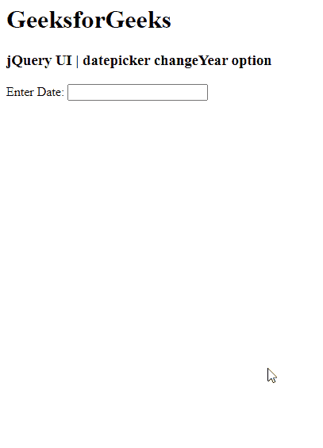

# jQuery UI DatePicker Change Year Option

> 哎哎哎: https://www.geeksforgeeks.org/jquery-ui-datepicker-changeyear-option/

jQuery UI 由 GUI 小部件、视觉效果和使用 jQuery、CSS 和 HTML 实现的主题组成。jQuery 用户界面非常适合为网页构建用户界面。jQuery UI 中的 `datepicker()` 小部件允许用户轻松直观地输入日期。在本文中，我们将看到如何在 jQuery UI 日期选择器中使用 `changeYear` 选项。`changeYear` 选项用于在 jQuery 用户界面日期选择器中直接更改年份。

**语法:**

```html
$(".selector").datepicker(
   { changeYear: true }
);
```

**步骤:**

*   首先，添加项目所需的 jQuery UI 脚本。

> <link href="https://code.jquery.com/ui/1.10.4/themes/ui-lightness/jquery-ui.css" rel="stylesheet">

**示例:**

## HTML

**输出:**



参考: https://api.jqueryui.com/datepicker/