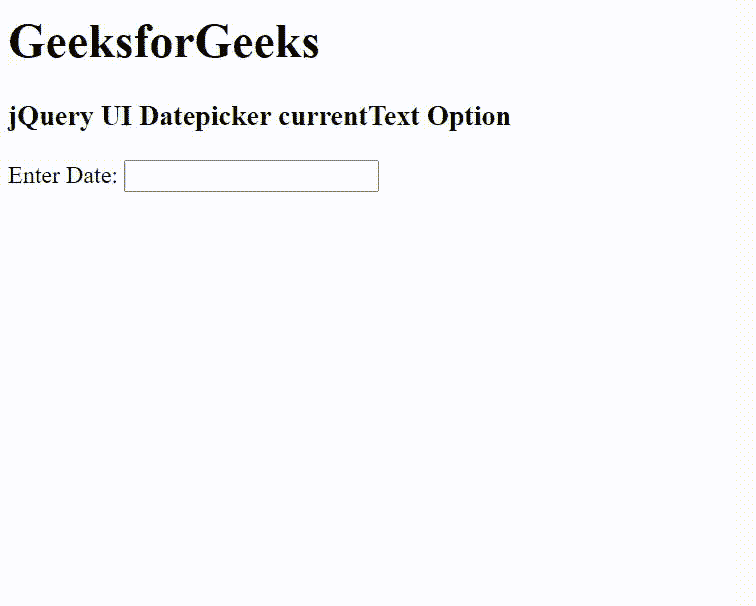

# jQuery UI Datepicker currentText 选项

> 哎哎哎: [https://www.geeksforgeeks.org/jquery-ui-datepicker-current-text-option/](https://www.geeksforgeeks.org/jquery-ui-datepicker-current-text-option/)

jQuery UI 由 GUI 小部件、视觉效果和使用 jQuery、CSS 和 HTML 实现的主题组成。jQuery 用户界面非常适合为网页构建用户界面。jQuery UI Datepicker `currentText` 选项用于显示当天链接的文本。另外，使用 `showButtonPanel` 选项来显示按钮。

**语法:**

```javascript
$( ".selector" ).datepicker({
  currentText: "Now"
});
```

**CDN 链接:** 首先，添加项目所需的 jQuery UI 脚本。

```html
<link rel="stylesheet" href="//code.jquery.com/ui/1.12.1/themes/smoothness/jquery-ui.css">
<script src="//code.jquery.com/jquery-1.12.4.js"></script>
<script src="//code.jquery.com/ui/1.12.1/jquery-ui.js"></script>
```

**示例:**

## HTML

```html
<!DOCTYPE html>
<html lang="en">

<head>
    <meta charset="utf-8" />
    <link href="https://code.jquery.com/ui/1.10.4/themes/ui-lightness/jquery-ui.css" rel="stylesheet" />
    <script src="https://code.jquery.com/jquery-1.10.2.js"></script>
    <script src="https://code.jquery.com/ui/1.10.4/jquery-ui.js"></script>

    <script>
        $(function () {
            $("#gfg").datepicker({
                showButtonPanel: true,
                currentText: "GFG"
            });
        });
    </script>
</head>

<body>
    <h1>GeeksforGeeks</h1>
    <h3>jQuery UI Datepicker currentText Option</h3>

    <div>Enter Date: <input type="text" id="gfg" /></div>
</body>

</html>
```

**输出:**



**参考:** [https://api.jqueryui.com/datepicker/#option-currentText](https://api.jqueryui.com/datepicker/#option-currentText)