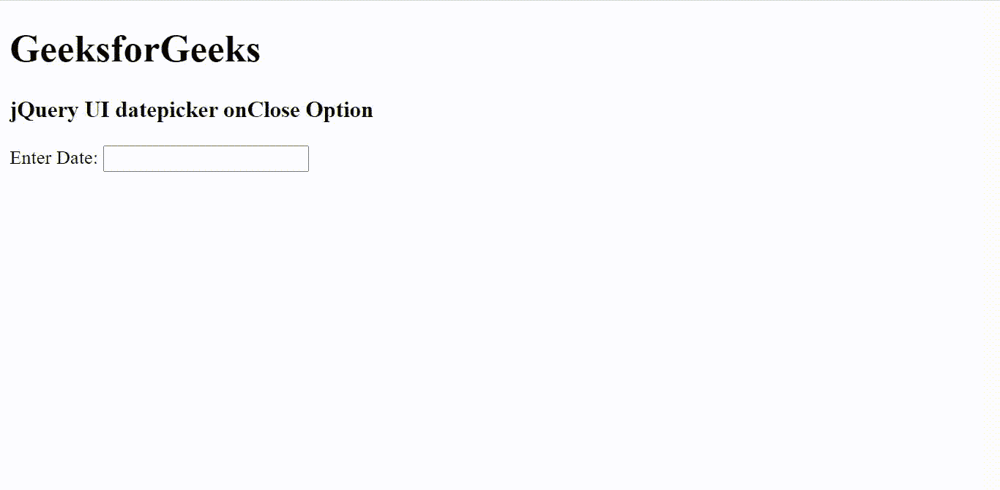

# jQuery UI DatePicker onClose 选项

> 哎哎哎: [https://www.geeksforgeeks.org/jquery-ui-datepicker-onclose-option/](https://www.geeksforgeeks.org/jquery-ui-datepicker-onclose-option/)

jQuery UI 由 GUI 小部件、视觉效果和使用 jQuery、CSS 和 HTML 实现的主题组成。jQuery 用户界面非常适合为网页构建用户界面。无论是否选择日期，当日期选择器关闭时，都会调用 jQuery UI DatePicker 的 `onClose` 选项。`onClose` 选项提供了一个函数，该函数将所选日期作为文本（如果没有则为空字符串）并将 `datepicker` 实例作为参数。

**语法:**

```html
onClose: Function( String dateText, Object inst ) {  }
```

**CDN 链接:** 首先，添加项目所需的 jQuery UI 脚本。

> <link rel="stylesheet" href="//code.jquery.com/ui/1.12.1/themes/smoothness/jquery-ui.css">
> <script src="//code.jquery.com/jquery-1.12.4.js"></script>
> <script src="//code.jquery.com/ui/1.12.1/jquery-ui.js"></script>

**示例:**

## HTML

```html
<!DOCTYPE html>
<html lang="en">

<head>
    <meta charset="utf-8" />
    <link href=
    "https://code.jquery.com/ui/1.10.4/themes/ui-lightness/jquery-ui.css"
        rel="stylesheet" />
    <script src="https://code.jquery.com/jquery-1.10.2.js">
    </script>
    <script src="https://code.jquery.com/ui/1.10.4/jquery-ui.js">
    </script>

<script>
        $(function () {
            $("#gfg").datepicker({
                onClose: function (date, datepicker) {
                    if (date != "") {
                        alert("Selected Date: " + date);
                    }
                }
            });
        });
    </script>
</head>

<body>
    <h1>GeeksforGeeks</h1>
    <h3>jQuery UI datepicker onClose Option</h3>

<div>Enter Date: <input type="text" id="gfg" /></div>
</body>

</html>
```

**输出:**



**参考:** [https://api.jqueryui.com/datepicker/#option-onClose](https://api.jqueryui.com/datepicker/#option-onClose)