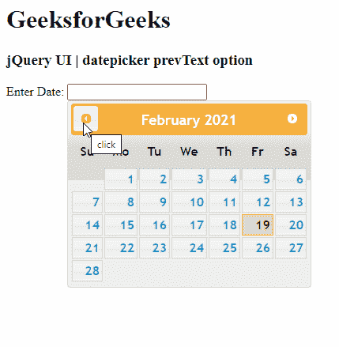

# jQuery UI Datepicker prevText 选项

> 哎哎哎: [https://www.geeksforgeeks.org/jquery-ui-datepicker-prevtext-option/](https://www.geeksforgeeks.org/jquery-ui-datepicker-prevtext-option/)

jQuery UI 由 GUI 小部件、视觉效果和使用 jQuery、CSS 和 HTML 实现的主题组成。jQuery 用户界面非常适合为网页构建用户界面。jQuery UI 中的 `Datepicker` 小部件允许用户轻松直观地输入日期。在本文中，我们将看到如何在 jQuery UI 日期选择器中使用 `prevText` 选项。`prevText` 选项指定在 jQuery UI 日期选择器中替换上一个月的默认标题的文本。

**语法:**

```javascript
$(".selector").datepicker({
   prevText: 'click'
});
```

**CDN 链接:** 首先，添加项目所需的 jQuery UI 脚本。

```html
<link href="https://code.jquery.com/ui/1.10.4/themes/ui-lightness/jquery-ui.css" rel="stylesheet">
<script src="https://code.jquery.com/jquery-1.10.2.js"></script>
<script src="https://code.jquery.com/ui/1.10.4/jquery-ui.js"></script>
```

**例 1:**

## HTML

```html
<!DOCTYPE html>
<html lang="en">
  <head>
    <meta charset="utf-8" />
    <link href="https://code.jquery.com/ui/1.10.4/themes/ui-lightness/jquery-ui.css" rel="stylesheet"/>
    <script src="https://code.jquery.com/jquery-1.10.2.js"></script>
    <script src="https://code.jquery.com/ui/1.10.4/jquery-ui.js"></script>

    <!-- Javascript -->
    <script>
      $(function () {
        $("#gfg").datepicker({ dateFormat: "yy/dd/mm", prevText: "click" });
      });
    </script>
  </head>
  <h1>GeeksforGeeks</h1>
  <h3>jQuery UI | datepicker prevText option</h3>

  <body>
    <!-- HTML -->
    <p>Enter Date: <input type="text" id="gfg" /></p>
  </body>
</html>
```

**输出:**



**参考:** [https://api.jqueryui.com/datepicker/#option-prevText](https://api.jqueryui.com/datepicker/#option-prevText)