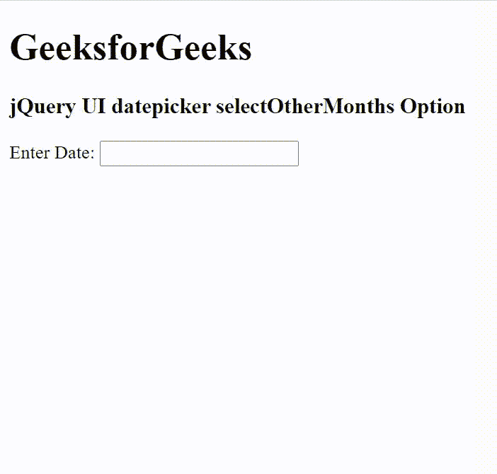

# jQuery UI DatePicker selectOtherMonths 选项

> 原文：[https://www.geeksforgeeks.org/jquery-ui-datepicker-selectothermonths-option/](https://www.geeksforgeeks.org/jquery-ui-datepicker-selectothermonths-option/)

jQuery UI 由 GUI 小部件、视觉效果和使用 jQuery、CSS 和 HTML 实现的主题组成。jQuery 用户界面非常适合为网页构建用户界面。jQuery UI 日期选择器 `selectOtherMonths` 选项用于检查当月之前或之后显示的其他月份中的天数是否可选。如果设置为 `true`，将显示 `showOtherMonths` 选项。

## 语法

```javascript
$( ".selector" ).datepicker({
  selectOtherMonths: Boolean
});
```

## CDN 链接

首先，添加项目所需的 jQuery UI 脚本。

```html
<link rel="stylesheet" href="//code.jquery.com/ui/1.12.1/themes/smoothness/jquery-ui.css">
<script src="//code.jquery.com/jquery-1.12.4.js"></script>
<script src="//code.jquery.com/ui/1.12.1/jquery-ui.js"></script>
```

## 示例

### HTML

```html
<!DOCTYPE html>
<html lang="en">

<head>
    <meta charset="utf-8" />
    <link href="https://code.jquery.com/ui/1.10.4/themes/ui-lightness/jquery-ui.css" rel="stylesheet" />
    <script src="https://code.jquery.com/jquery-1.10.2.js"></script>
    <script src="https://code.jquery.com/ui/1.10.4/jquery-ui.js"></script>
    <script>
        $(function () {
            $("#gfg").datepicker({
                showOtherMonths: true,
                selectOtherMonths: true
            });
        });
    </script>
</head>

<body>
    <h1>GeeksforGeeks</h1>
    <h3>jQuery UI datepicker selectOtherMonths Option</h3>
    <div>Enter Date: <input type="text" id="gfg" /></div>
</body>

</html>
```

## 输出



选择其他月份

## 参考资料

[https://api.jqueryui.com/datepicker/#option-selectOtherMonths](https://api.jqueryui.com/datepicker/#option-selectOtherMonths)