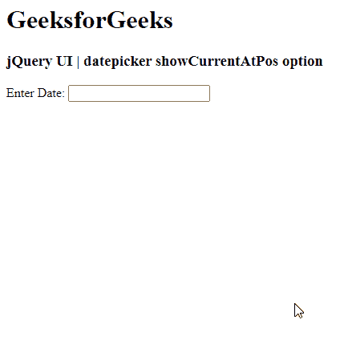

# jQuery UI DatePicker showCurrentAtPos 选项

> 哎哎哎: [https://www.geeksforgeeks.org/jquery-ui-datepicker-showcurrentatpos-option/](https://www.geeksforgeeks.org/jquery-ui-datepicker-showcurrentatpos-option/)

jQuery UI 由 GUI 小部件、视觉效果和使用 jQuery、CSS 和 HTML 实现的主题组成。jQuery 用户界面非常适合为网页构建用户界面。jQuery UI 日期选择器小部件允许用户轻松直观地输入日期。在本文中，我们将看到如何在 jQuery UI Datepicker 中使用 `showCurrentAtPos` 选项。

从左上角开始的 `showCurrentAtPos` 选项，其中包含当前日期的月份应该放在 jQuery UI 日期选择器中。此选项指定日期选择器当前月份的显示位置。

### 语法:

```javascript
$(".selector").datepicker(
   {showCurrentAtPos: 2}
);
```

### 方法:

首先，添加项目所需的 jQuery UI 脚本。

```html
<link href="https://code.jquery.com/ui/1.10.4/themes/ui-lightness/jquery-ui.css" rel="stylesheet">
<script src="https://code.jquery.com/jquery-1.10.2.js"></script>
<script src="https://code.jquery.com/ui/1.10.4/jquery-ui.js"></script>
```

### 示例:

在以下示例中，当前月份被设置为位置 2。加载日期选择器时，显示第二个前一个月。

## 超文本标记语言

```html
<!doctype html>
<html lang="en">

<head>
    <meta charset="utf-8">
    <link href=
"https://code.jquery.com/ui/1.10.4/themes/ui-lightness/jquery-ui.css"
        rel="stylesheet">

    <script src=
        "https://code.jquery.com/jquery-1.10.2.js">
    </script>

    <script src=
        "https://code.jquery.com/ui/1.10.4/jquery-ui.js">
    </script>

    <script>
        $(function () {
            $("#gfg").datepicker(
                { showCurrentAtPos: 2 }
            );
        });
    </script>
</head>

<body>
    <h1>GeeksforGeeks</h1>
    <h3>jQuery UI | datepicker showCurrentAtPos option</h3>

    <p>Enter Date: <input type="text" id="gfg"></p>
</body>

</html>
```

### 输出:



### 参考:

[https://api.jqueryui.com/category/widgets/](https://api.jqueryui.com/category/widgets/)