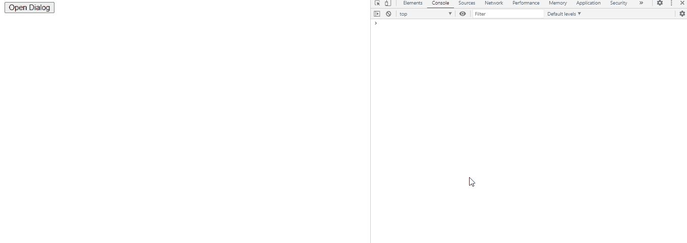

# jQuery UI 对话框关闭事件

> 原文: [https://www.geeksforgeeks.org/jquery-ui-dialog-closeevent-ui-event/](https://www.geeksforgeeks.org/jquery-ui-dialog-closeevent-ui-event/)

当对话框关闭时，触发 jQuery UI `close` 事件。

在这里了解更多 jQuery 选择器和事件[。](https://www.geeksforgeeks.org/jquery-selectors-and-event-methods/)

## 语法

```javascript
$(".selector").dialog({
   close: function( event, ui ) {
       console.log('closed')
   },
});
```

## 实现

首先，添加项目所需的 jQuery Mobile 脚本。

```html
<link href="https://code.jquery.com/ui/1.10.4/themes/ui-lightness/jquery-ui.css" rel="stylesheet">
<script src="https://code.jquery.com/jquery-1.10.2.js"></script>
<script src="https://code.jquery.com/ui/1.10.4/jquery-ui.js"></script>
```

“打开对话框”按钮将触发点击功能(`#gfg`)，该功能将进一步打开对话框(`#gfg2`)中的`<textarea>`。

`close(event, ui)`：当我们点击对话框中的关闭按钮时触发。此事件附加了回调函数。
- `event`: 类型 -> `Event`
- `ui`: 类型 -> `Object`
- 回调函数: `function(event, ui) { console.log('closed') }`

## 示例 1

### HTML

```html
<!doctype html>
<html lang="en">
   <head>
      <meta charset="utf-8">
      <link href="https://code.jquery.com/ui/1.10.4/themes/ui-lightness/jquery-ui.css" rel="stylesheet">
      <script src="https://code.jquery.com/jquery-1.10.2.js"></script>
      <script src="https://code.jquery.com/ui/1.10.4/jquery-ui.js"></script>

      <script type="text/javascript">
         $(function() {
            $("#gfg2").dialog({
               autoOpen: false,
               close: function( event, ui ) {
                  console.log('closed')
               },
            });
            $("#gfg").click(function() {
               $("#gfg2").dialog( "open" );
            });
         });
      </script>
   </head>

   <body>
      <div id="gfg2" title="GeeksforGeeks">
         <textarea>jQuery UI | close(event, ui) Event</textarea>
      </div>
      <button id="gfg">Open Dialog</button>
   </body>
</html>
```

**输出:**

