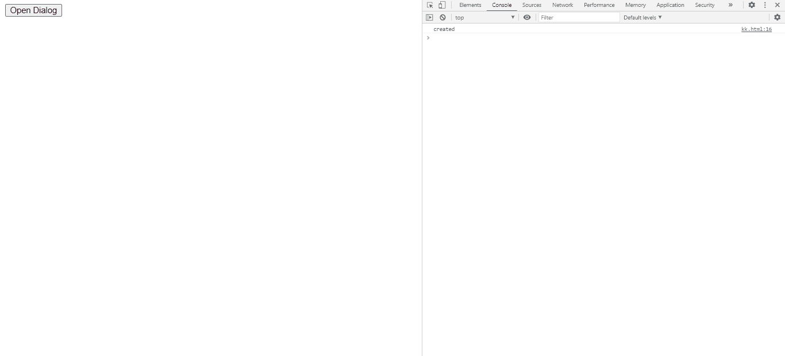

# jQuery 用户界面对话框创建事件

> 原文: [https://www.geeksforgeeks.org/jquery-ui-dialog-create-event/](https://www.geeksforgeeks.org/jquery-ui-dialog-create-event/)

创建对话框时会触发 jQuery UI 创建事件。

在这里了解更多 jQuery 选择器和事件。

**语法:**

```html
$(".selector").dialog (
   create: function( event, ui ) {
       console.log('created')
   },
```

**进场:**

首先，添加项目所需的 jQuery Mobile 脚本。

```html
<link href = 
"https://code.jquery.com/ui/1.10.4/themes/ui-lightness/jquery-ui.css"
    rel = "stylesheet">
<script src = "https://code.jquery.com/jquery-1.10.2.js"></script>
<script src = "https://code.jquery.com/ui/1.10.4/jquery-ui.js">
</script>
```

“打开对话框”按钮将触发点击功能(`#gfg`)，该功能将进一步打开对话框(`#gfg2`)中的`<textarea>`。

`create(event, ui)`：对话框创建时触发。这个创建附加了一个回调函数，它在对话框创建后被触发。
*   `event`: 类型 -> `Event`
*   `ui`: 类型 -> `Object`
*   回调函数: `function( event, ui ) { console.log('created')}`

**例 1:**

## 超文本标记语言

```html
<!doctype html>
<html lang = "en">
   <head>
      <meta charset = "utf-8">
      <link href = 
"https://code.jquery.com/ui/1.10.4/themes/ui-lightness/jquery-ui.css"
         rel = "stylesheet">
      <script src = "https://code.jquery.com/jquery-1.10.2.js">
        </script>
      <script src = "https://code.jquery.com/ui/1.10.4/jquery-ui.js">
        </script>

<script type = "text/javascript">
         $(function() {
            $( "#gfg2" ).dialog({
          autoOpen: false, 
               create: function( event, ui ) {
                  console.log('created')
               },
            });
            $( "#gfg" ).click(function() {
               $( "#gfg2" ).dialog( "open" );
            });
         });
      </script>
   </head>

<body>
      <div id = "gfg2" title="GeeksforGeeks">
         <textarea>jQuery UI | create(event, ui) Event</textarea>
      </div>
      <button id = "gfg">Open Dialog</button>
   </body>
</html>
```

**输出:**

