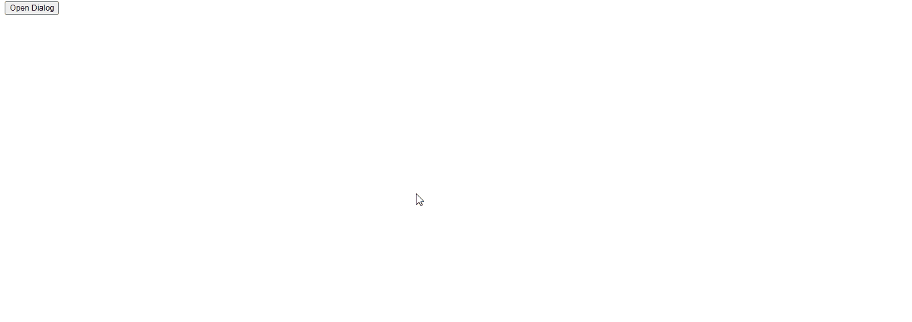

# jQuery UI 对话框 destroy() 方法

> 原文：[https://www.geeksforgeeks.org/jquery-ui-dialog-destroy-method/](https://www.geeksforgeeks.org/jquery-ui-dialog-destroy-method/)

`destroy()` 方法用于销毁对话框。此方法不接受任何参数。

## 语法

```html
$( ".selector" ).dialog("destroy");
```

## 方法

首先，添加项目所需的 jQuery UI 脚本。

> <link href="https://code.jquery.com/ui/1.10.4/themes/ui-lightness/jquery-ui.css" rel="stylesheet">
> <script src="https://code.jquery.com/jquery-1.10.2.js"></script>
> <script src="https://code.jquery.com/ui/1.10.4/jquery-ui.js"></script>

## 示例

```html
<!doctype html>
<html lang="en">

<head>
    <meta charset="utf-8">
    <link href=
"https://code.jquery.com/ui/1.10.4/themes/ui-lightness/jquery-ui.css"
        rel="stylesheet">
    <script src="https://code.jquery.com/jquery-1.10.2.js"></script>
    <script src="https://code.jquery.com/ui/1.10.4/jquery-ui.js">
    </script>

<script>
        $(function () {
            $("#gfg").dialog({
                autoOpen: false,
            });
            $("#geeks").click(function () {
                $("#gfg").dialog("destroy");
            });
        });
    </script>
</head>

<body>
    <div id="gfg">
        Jquery UI| destroy dialog method
    </div>

<button id="geeks">Open Dialog</button>
</body>

</html>
```

## 输出

