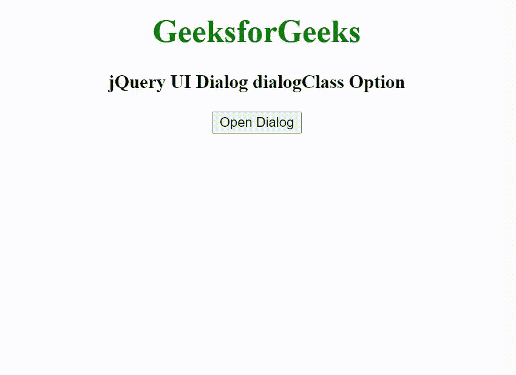

# jQuery UI 对话框 dialogClass 选项

> 原文：[https://www.geeksforgeeks.org/jquery-ui-dialog-dialogclass-option/](https://www.geeksforgeeks.org/jquery-ui-dialog-dialogclass-option/)

jQuery UI 由 GUI 小部件、视觉效果和使用 HTML、CSS 和 jQuery 实现的主题组成。jQuery 用户界面非常适合为网页构建用户界面。`dialogClass` 选项用于为对话框添加一个额外的类名，以便进行自定义主题化。

**语法：**

```javascript
$( ".selector" ).dialog({
  dialogClass: "alert"
});
```

**CDN 链接：** 首先，添加项目所需的 jQuery UI 脚本。

```html
<link rel="stylesheet" href="https://code.jquery.com/ui/1.10.4/themes/ui-lightness/jquery-ui.css">
<script src="https://code.jquery.com/jquery-1.10.2.js"></script>
<script src="https://code.jquery.com/ui/1.10.4/jquery-ui.js"></script>
```

**示例：**

## HTML

```html
<!doctype html>
<html lang="en">

<head>
    <meta charset="utf-8">
    <link href="https://code.jquery.com/ui/1.10.4/themes/ui-lightness/jquery-ui.css" rel="stylesheet">
    <script src="https://code.jquery.com/jquery-1.10.2.js"></script>
    <script src="https://code.jquery.com/ui/1.10.4/jquery-ui.js"></script>
    <style>
        .GFG {
            font-size: 25px;
            font-weight: bold;
        }
    </style>
    <script>
        $(function () {
            $("#gfg").dialog({
                autoOpen: false,
                dialogClass: "GFG"
            });
            $("#geeks").click(function () {
                $("#gfg").dialog("open");
            });
        });
    </script>
</head>

<body style="text-align: center;">
    <h1 style="color:green;">GeeksforGeeks</h1>
    <h3>jQuery UI Dialog dialogClass Option</h3>
    <button id="geeks">Open Dialog</button>
    <div id="gfg" title="GeeksforGeeks">
        Welcome to GeeksforGeeks
    </div>
</body>

</html>
```

**输出：**

