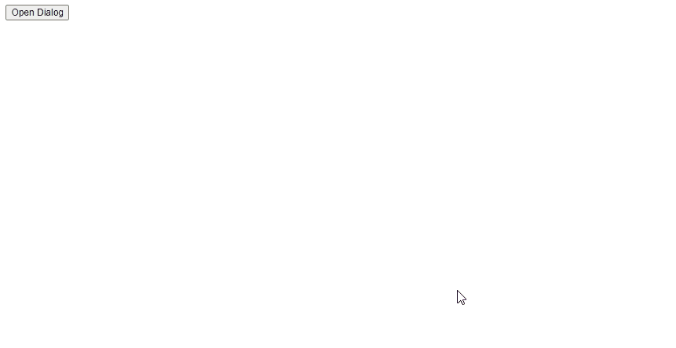
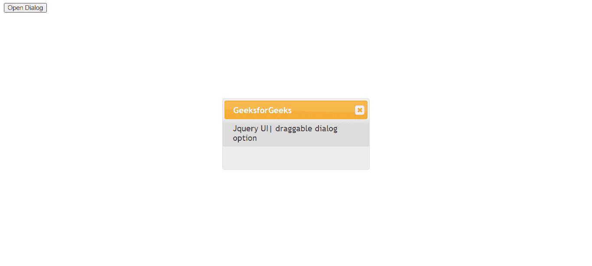

# jQuery UI 对话框 draggable 选项

> 原文：`https://www.geeksforgeeks.org/jquery-ui-dialog-draggable-option/`

`draggable` 选项如果设置为 `true`，对话框将可拖动；如果设置为 `false`，对话框将不可拖动。默认值为 `true`。

## 语法

```javascript
$( ".selector" ).dialog({
    draggable: true
});
```

## 方法

首先，添加项目所需的 jQuery UI 脚本。

```html
<link href="https://code.jquery.com/ui/1.10.4/themes/ui-lightness/jquery-ui.css" rel="stylesheet">
<script src="https://code.jquery.com/jquery-1.10.2.js"></script>
<script src="https://code.jquery.com/ui/1.10.4/jquery-ui.js"></script>
```

## 例 1

```html
<!doctype html>
<html lang="en">

<head>
    <meta charset="utf-8">
    <link href="https://code.jquery.com/ui/1.10.4/themes/ui-lightness/jquery-ui.css" rel="stylesheet">
    <script src="https://code.jquery.com/jquery-1.10.2.js"></script>
    <script src="https://code.jquery.com/ui/1.10.4/jquery-ui.js"></script>
    <script>
        $(function () {
            $("#gfg").dialog({
                autoOpen: false,
                draggable: true
            });
            $("#geeks").click(function () {
                $("#gfg").dialog("open");
            });
        });
    </script>
</head>

<body>
    <div id="gfg" title="GeeksforGeeks">
        Jquery UI| draggable dialog option
    </div>
    <button id="geeks">Open Dialog</button>
</body>

</html>
```

**输出：**



## 例 2

```html
<!doctype html>
<html lang="en">

<head>
    <meta charset="utf-8">
    <link href="https://code.jquery.com/ui/1.10.4/themes/ui-lightness/jquery-ui.css" rel="stylesheet">
    <script src="https://code.jquery.com/jquery-1.10.2.js"></script>
    <script src="https://code.jquery.com/ui/1.10.4/jquery-ui.js"></script>
    <script>
        $(function () {
            $("#gfg").dialog({
                autoOpen: false,
                draggable: false
            });
            $("#geeks").click(function () {
                $("#gfg").dialog("open");
            });
        });
    </script>
</head>

<body>
    <div id="gfg" title="GeeksforGeeks">
        Jquery UI| draggable dialog option
    </div>
    <button id="geeks">Open Dialog</button>
</body>

</html>
```

**输出：**

