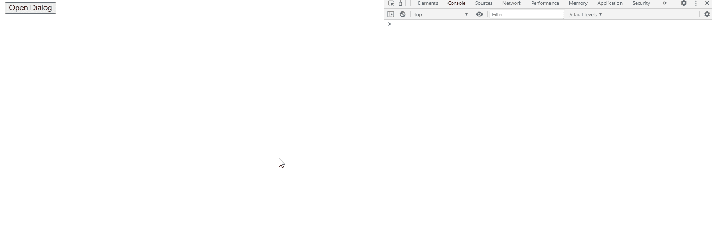

# jQuery UI 对话框 `resizeStop()` 事件

> 原文: [https://www.geeksforgeeks.org/jquery-ui-dialog-resizestop-event/](https://www.geeksforgeeks.org/jquery-ui-dialog-resizestop-event/)

jQuery UI `resizeStop` 事件在我们调整大小后对话框停止时触发。

## 语法

```javascript
$(".selector").dialog({
    resizeStop: function( event, ui ) {
        console.log('resized')
    },
});
```

## 方法

首先，添加项目所需的 jQuery UI 脚本。

```html
<link href="https://code.jquery.com/ui/1.10.4/themes/ui-lightness/jquery-ui.css" rel="stylesheet">
<script src="https://code.jquery.com/jquery-1.10.2.js"></script>
<script src="https://code.jquery.com/ui/1.10.4/jquery-ui.js"></script>
```

## 示例

### HTML

```html
<!doctype html>
<html lang="en">

<head>
  <meta charset="utf-8">
  <link rel="stylesheet" href="https://code.jquery.com/ui/1.10.4/themes/ui-lightness/jquery-ui.css">
  <script src="https://code.jquery.com/jquery-1.10.2.js"></script>
  <script src="https://code.jquery.com/ui/1.10.4/jquery-ui.js"></script>
  <script type="text/javascript">
    $(function() {
      $("#gfg2").dialog({
        autoOpen: false,
        resizeStop: function( event, ui ) {
          console.log('resized')
        },
      });
      $("#gfg").click(function() {
        $("#gfg2").dialog( "open" );
      });
    });
  </script>
</head>

<body>
  <div id="gfg2" title="GeeksforGeeks">
    <textarea>
      jQuery UI |
      resizeStop(event, ui) Event
    </textarea>
  </div>

  <button id="gfg">Open Dialog</button>
</body>

</html>
```

## 输出

